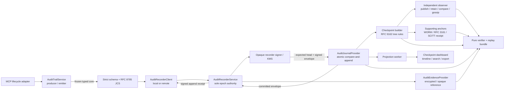

# KYA-OS Auditability Service

## Protocol architecture, implementation handoff, and evidence model

**Status:** Implemented protocol and reference architecture; deployment adapters remain integration work
**Date:** 2026-07-21
**Scope reviewed:** `@kya-os/mcp`, the public KYA-OS protocol/schema sites, Checkpoint, and `xmcp-i`
**Decision owner:** KYA-OS maintainers
**Recommended decision:** Adopt a typed, privacy-minimal audit event service backed by atomic append-only ledgers, per-entry recorder receipts, RFC 9162-style Merkle checkpoints, independent checkpoint observation plus optional supporting anchors, a separately governed evidence vault, and a pure historical verifier.

---

## 1. Executive decision

KYA-OS already has the hardest prerequisite for meaningful auditability: signed, content-bound proof artifacts and a clean provider/service architecture. It does **not** yet have a verifiable audit trail. The current `AuditLogProvider` is a best-effort sink that intentionally records only the first successful call in a session, does not establish ordering or completeness, and silently loses records when its sink fails.

The recommended architecture keeps the existing detached proof format stable and adds an audit domain beside it:

1. **Origin/action evidence** — the existing detached proof binds the actor/server, request, response, audience, session, authorization outcome, and delegation evidence.
2. **Recorder receipt** — a new signed receipt proves that the single authoritative recorder for a ledger epoch accepted a typed event at a particular sequence and chain head.
3. **Checkpoint evidence** — a signed Merkle checkpoint proves batch inclusion and consistency. Independent publication plus an authenticated monitor/gossip protocol makes conflicting observed views detectable; an RFC 3161 timestamp or WORM copy supplies time/durability evidence but is not, by itself, a split-view detector.
4. **Evidence vault** — exact proofs and optional sensitive collateral are integrity-committed, encrypted under randomized AEAD, stored under opaque identifiers, access-controlled, and retained independently from a pseudonymous/keyed integrity ledger with its own declared segment-retention policy.
5. **Historical verifier and replay bundle** — a pure verifier reconstructs what was observed and authorized at the time without applying live nonce/freshness rules or rerunning side-effecting tools.
6. **Rebuildable projections** — Checkpoint remains the operational query and investigation experience. It may also run the managed authoritative recorder, or it may mirror a self-hosted recorder; in either topology, its current proof, gateway, activity, and session tables are rebuildable projections rather than evidence authorities.

This is the best fit because it preserves the repository's small interfaces, dependency inversion, platform portability, two-line adoption path, and TDD culture. It also avoids the two common design traps: putting mutable chain state into every MCP response proof, or pushing private event payloads onto a public blockchain.

### Grades

| Scope | Baseline / delivered grade | Reason |
|---|---:|---|
| `@kya-os/mcp` architecture excluding unfinished audit | **A-** | Excellent ports, composition, proof primitives, strict typing, tests, and incremental DX. |
| `@kya-os/mcp` overall today | **B+ — 8.4/10** | Strong foundation, with material proof-replay, schema-drift, and operational audit gaps. |
| Current `@kya-os/mcp` audit subsystem | **D+ — 3.8/10** | A lossy sink, not an ordered, complete, independently verifiable ledger. |
| Checkpoint product architecture | **A-** | Mature services, tenant scoping, projections, export surfaces, and investigation UX. |
| Checkpoint auditability today | **C+** | Rich records and proofs, but mutable projections and some UI claims exceed verification. |
| `xmcp-i` runtime/provider architecture | **B+** | Good portability and adapter seams; duplicated audit implementations and dependency skew remain. |
| Recommended design, on paper | **A — 9.5/10** | Best weighted option across integrity, privacy, portability, replay, standards, and DX. |
| Delivered `@kya-os/mcp` protocol/reference implementation | **A — 9.6/10** | The protocol, reference providers, provider contract kit, failure/concurrency/privacy tests, historical verifier, and independent cross-language conformance are implemented. Production datastore and product adapters remain deployment-specific. |

The B+/D+ rows are the **pre-implementation baseline** established during the
architecture review. The delivered grade reflects this change set; it does not
retroactively grade the separately maintained Checkpoint or `xmcp-i` repositories.

The protocol should market this accurately: it becomes a **compliance-enabling evidence layer**, not a magic declaration that every adopter is compliant.

---

## 2. What was examined and empirically verified before implementation

### Local validation

The current `@kya-os/mcp` checkout passed:

- **110 test files**
- **1,640 passing tests; 1 skipped**
- `npm run typecheck`
- `npm run lint`

The repository has strict TypeScript, coverage gates, multi-runtime CI, independent Python verification, and conformance vectors. Those are important evidence that the recommended audit design can be delivered with the required rigor.

### Primary local evidence

- The public adoption path is intentionally small: [`README.md`](README.md#L57) and [`with-kya-os-server.ts`](src/middleware/with-kya-os-server.ts#L97).
- Provider ports and the composition root are cleanly separated: [`src/providers/base.ts`](src/providers/base.ts#L11), [`src/middleware/with-kya-os.ts`](src/middleware/with-kya-os.ts#L72), and [`src/middleware/with-kya-os.deps.ts`](src/middleware/with-kya-os.deps.ts#L38).
- Request and response binding uses JCS and SHA-256: [`src/proof/generator.ts`](src/proof/generator.ts#L83); verification fails closed on content mismatch in [`src/proof/verifier.ts`](src/proof/verifier.ts#L244).
- The card-proof subsystem provides the best internal precedent for an opaque signer, injected clock, strict schemas, per-request nonce, and fail-closed verification: [`src/card/proof/types.ts`](src/card/proof/types.ts#L123) and [`src/card/proof/verify.ts`](src/card/proof/verify.ts#L96).

### Public protocol and schema review

The public protocol explains proofs as non-repudiable, integrity-bound, offline-verifiable audit evidence. The public schema registry also publishes an `audit/record/v1.0.0` schema. The package implementation, local schema directory, conformance document, and public schema are not fully aligned today; Section 3 lists the exact gaps.

---

## 3. Current-state assessment

### 3.1 What is excellent

The broader architecture genuinely deserves its positive assessment:

- **Dependency inversion:** crypto, clock, fetch, storage, nonce, identity, grant, and session behavior are ports rather than embedded platform assumptions.
- **Interface segregation:** most providers have narrow roles and in-memory/reference implementations.
- **Composition:** `createKyaOsMiddleware` assembles explicit collaborators rather than relying on global state.
- **Incremental DX:** adopters can add KYA-OS to an MCP server without rewriting the server.
- **Cryptographic portability:** JWS, JCS, DID resolution, and injectable signing make browser, Node, edge, and KMS/HSM deployments realistic.
- **TDD/conformance:** deterministic vectors and a large test suite make protocol evolution safer.

The audit design should look and feel like these existing primitives, not like a separate framework bolted onto the package.

### 3.2 The current audit provider is not a chain

The current [`AuditRecord`](src/types/protocol.ts#L467) has only ten fields. It has no event ID, event type/version, sequence, previous hash, entry hash, recorder signature, checkpoint, outcome, delegation lineage, evidence reference, causation, or trace context.

[`MemoryAuditLogProvider`](src/providers/audit-log.ts#L65) deliberately deduplicates by session. Ten tool calls in one session produce one audit record; the test suite explicitly locks in that behavior. Production middleware only invokes `logAuditRecord()` after a successful, non-error handler result. It does not log handler errors, denials, step-up requests, `needs_authorization`, replay rejection, delegation lifecycle, key rotation, outbound attachment, or checkpoint events. `logEvent()` has no production call sites.

Audit sink failures are caught and swallowed. That is a defensible availability default for a development logger, but it makes completeness unclaimable. `verified: "yes"` currently means that the server generated a proof, not that an independent verifier verified the proof.

The high-level `withKyaOs(server, options)` path cannot configure the existing `auditLog` provider, even though the lower-level middleware configuration can. That is a concrete DX inconsistency at the exact integration point most adopters are encouraged to use.

### 3.3 Spec and schema drift

The live public audit schema and the package currently disagree:

- The public schema defines `ts` as Unix seconds; `buildAuditRecord()` uses `Date.now()` milliseconds.
- The public schema allows an absent response hash; the implementation emits `"-"`, which does not satisfy the digest pattern.
- The public schema describes `did` as the calling agent; the middleware supplies the proof-signing server identity. Actor, subject, resource, responsible party, and recorder must be separate fields.
- The public audit schema exists in the registry but is absent from the package's local [`schemas/README.md`](schemas/README.md#L5) inventory and conformance vectors.
- Public audit-level language and local `CONFORMANCE.md` do not consistently state when audit is optional versus required.

The new service should start with a single canonical schema source and generated/cross-language conformance artifacts. Do not evolve the ambiguous `audit.v1` shape in place.

### 3.4 Proof and replay blockers

These are not merely audit niceties; they affect whether historical evidence can be independently replayed.

1. **The legacy response proof reuses the session nonce.** `ProofGenerator` copies the handshake/session nonce into each response proof, while `ProofVerifier` consumes `(nonce, did)` once. Empirically, two different proofs from one session used the same nonce: the first verified and the second failed `NONCE_REPLAY_DETECTED`. Introduce a signed per-call nonce/event ID and retain the handshake nonce only as a session-binding value.
2. **The current verifier is live, not historical.** It checks current freshness and mutates the live nonce cache. Historical verification needs a pure path that verifies signature, content, audience, key/time/status evidence as observed, and never consumes operational replay state.
3. **Legacy protected-header KID binding is incomplete.** The legacy JWS path validates the supplied JWK/algorithm but does not require the protected header's KID to match. The newer card-proof verifier is the correct precedent.
4. **Canonicalization is split.** Proof, delegation, card-proof, Checkpoint gateway hashing, and older Merkle code do not all use the same safe canonicalization behavior. One versioned digest module must reject unsupported JSON values and cycles before applying RFC 8785 JCS.
5. **Delegation history is mutable/incomplete.** Delegation graph writes and cascade revocation are not transactionally atomic, historical status-list versions are not preserved, and a verification cache keyed only by VC ID can reuse results across different credential bytes or weakened verification profiles.

These findings should be addressed before KYA-OS describes a bundle as reproducibly replayable.

### 3.5 Cross-repository reality

#### Checkpoint

Checkpoint already has strong operational projections:

- a scoped KYA event ingestion route;
- proof, gateway-call, session, delegation, and activity tables;
- an audit list with filters and CSV/JSON export;
- proof/timeline investigation UI;
- argument hashing and explicit avoidance of raw gateway arguments;
- a sequential per-batch event mapper.

Those are useful projection and product surfaces, not a ledger. Events are mapped into heterogeneous mutable tables, original canonical envelopes and cross-table ordering are lost, and some links are generated or reconstructed after ingestion. Gateway signing, database persistence, and remote proof reporting are separate best-effort operations. A stored attestation hash can currently render as “Verified” or “Signed & replayable” without chain, checkpoint, key-policy, or evidence-completeness verification.

Checkpoint should preserve its current list/detail pattern but consume an accepted ledger entry and build projections from it. A CSV remains a human report; it is not the cryptographic evidence export.

#### `xmcp-i`

`xmcp-i` already follows the provider/builder/registry pattern needed for platform adapters. However, its Node and Cloudflare audit loggers duplicate logic, suppress records after the first event in a session, and describe randomized/time-dependent event hashes as deterministic. Existing rotation callbacks do not seal or checkpoint a log. Its KV proof archive performs non-atomic record/index writes and scans, so it cannot be an authoritative ordered ledger. Older Merkle/registry code contains placeholder or incomplete consistency behavior and must not become the protocol core.

Checkpoint also resolves mixed `@kya-os/mcp` versions through its dependency graph. Align protocol, contracts, runtime, and Cloudflare package versions before introducing a new wire contract.

---

## 4. Value proposition: before and after

| Dimension | Before | After the recommended service |
|---|---|---|
| Evidence unit | A signed proof on some successful responses | Every instrumented lifecycle/decision event captured under the declared mode is typed; exact proof and collateral are referenced |
| Retention | Optional sink; in-memory implementation keeps one call per session | Durable append semantics are explicit and adapter-conformance-tested |
| Ordering | Timestamps and session IDs only | Monotonic sequence and previous digest within a declared ledger |
| Tamper detection | Individual signature/content tamper can be detected | Mutation, insertion, deletion, reordering, gaps, and checkpoint inconsistency are detectable |
| Truncation/fork detection | Not available | Signed checkpoints plus independent retention and authenticated comparison/gossip expose rollback or conflict relative to known checkpoints |
| Failure behavior | Sink errors silently swallowed | `best-effort`, `buffered`, or `required` durability is declared and observable |
| Replay | Live verifier; old proof may fail freshness/replay state | Pure historical verification plus a portable evidence bundle |
| Privacy | Hash-only record but inconsistent semantics | Minimal ledger, encrypted evidence, retention class, legal hold, crypto-shredding, and explicit missing evidence |
| Dashboard | Presence of a hash can look verified | Separate origin, chain, checkpoint, anchor, and evidence-completeness states |
| Audit export | Rows/CSV/JSON | Signed bundle with records, proofs, checkpoints, inclusion/consistency proofs, collateral, and verification report |
| Trust model | Trust the operator's logs | Verify the evidence and the properties the selected assurance profile promises |

The commercial and protocol value is substantial: shorter incident investigations, defensible auditor/customer exports, evidence-backed agent reputation, safer delegation analysis, and a clear accountability layer after authorization. It changes the KYA-OS claim from “we recorded a signed thing” to “a third party can verify what was recorded, where it sits in an observed history, what evidence was available, and which checks passed.”

It does **not** prove that uninstrumented actions never happened, that signed inputs were semantically true, or that an external tool performed its side effect exactly as reported.

---

## 5. Terminology and trust model

### 5.1 Three distinct attestations

Do not collapse these into one overloaded `proof` field:

| Artifact | Issuer | Proves | Does not prove |
|---|---|---|---|
| **Detached proof** | MCP actor/server identity | Origin and integrity of the signed request/response/decision claims | Log inclusion, completeness, or durable retention |
| **Append receipt** | The ledger epoch's authoritative recorder | The recorder accepted this exact entry at `(ledger, epoch, sequence, head)` | That every source event reached the recorder or that the recorder never forked |
| **Checkpoint/observer receipt** | Recorder plus an independently administered observer | A particular tree head was retained/observed and can be compared with later heads | Truth of event semantics, global completeness, or events outside declared instrumentation |

### 5.2 Threats in scope

- Accidental or malicious modification of a retained event.
- Insertion, deletion, or reordering inside a ledger range.
- Duplicate/retried delivery.
- Concurrent writers creating forks or lost updates.
- Tail truncation relative to a known independently retained checkpoint, or conflicting views discovered by authenticated comparison/gossip.
- Wrong signer, key, algorithm, audience, or schema suite.
- Missing, expired, redacted, or destroyed evidence.
- Cross-tenant disclosure and unauthorized audit access.
- Projection divergence from the ledger.

### 5.3 Explicit non-guarantees

- The SDK cannot see an action that bypasses instrumentation.
- A valid signature does not make a false statement true.
- A local chain with no external trust root or observation cannot prove the operator never rewrote the entire history.
- The newest, not-yet-checkpointed tail can be truncated without cryptographic evidence outside the primary store.
- Middleware cannot atomically commit an arbitrary external side effect and an audit entry. A shared transaction/outbox is required where this guarantee matters.
- Verification replay is not execution replay. Models, third-party APIs, time, and side effects can be nondeterministic.
- Hashing personal data does not necessarily anonymize it; crypto-shredding a vault cannot erase identifiers embedded directly in an integrity entry.
- A bundle-supplied key, DID document, genesis, or checkpoint cannot bootstrap its own trust. The verifier needs an out-of-band verification policy or independently observed trust anchor.

---

## 6. Design requirements and invariants

The following are protocol invariants, not adapter preferences:

1. Every producer event has a stable `eventId` and frozen canonical producer-core bytes; recorder-assigned fields are outside that idempotency boundary.
2. The authoritative recorder performs duplicate lookup before assigning a new sequence/time. Redelivery of the same producer core returns the original envelope; reuse of an `eventId` with different producer-core bytes is a hard integrity error.
3. Exactly one recorder authority (or one consensus group acting as one authority) assigns sequence for a `(ledgerId, ledgerEpochId)`. Every committed entry carries both identifiers, a monotonically increasing decimal sequence within that epoch, and a previous entry digest (or `null` at epoch genesis).
4. The service validates a strict schema before canonicalization; unsupported JSON values and unknown critical fields fail closed.
5. Canonical bytes and hashes are reproducible across supported languages.
6. The audit service—not the persistence adapter—owns schema validation, canonicalization, hashing, signing, retry, and receipt creation.
7. An adapter must atomically compare the expected head and append the new entry. `get/set/delete/list` is not sufficient.
8. Entries are immutable. Corrections, redactions, disposal, and key transitions are new events.
9. Exact evidence and sensitive payloads are not placed in the integrity ledger by default.
10. The verifier distinguishes `valid`, `invalid`, and `indeterminate`; missing evidence is never silently treated as valid.
11. Historical authorization “as observed” is separate from current authorization/revocation status.
12. Every advertised audit capability is discoverable and testable. A no-op provider must advertise `none`; a mirror must never advertise itself as recorder/sequencer.
13. An audit profile's failure behavior is explicit. High-assurance profiles cannot silently degrade to memory or best effort.
14. All clocks are injectable. Ledger sequence is authoritative for local order; timestamps provide context, not concurrency serialization.
15. A projection is disposable and reproducible from the source ledger plus declared enrichment inputs.
16. Strong producer-to-recorder completeness claims require authenticated source identity, source sequence/high-water marks, a durable outbox or local required append, heartbeats, and receipt reconciliation. CAS proves only the accepted ledger history.
17. Direct ledger identifiers and party/session/action details are minimized. Protocol fields declare whether a value is a public identifier, pairwise pseudonym, tenant-keyed commitment, or vault reference.

---

## 7. Architecture alternatives and decision

Scores are 1–5, weighted by protocol importance: integrity/completeness 25%, scalability/concurrency 15%, DX/SOLID fit 15%, portability/adapters 10%, privacy/retention 15%, replay/export 10%, standards interoperability 10%.

| Option | Integrity | Scale | DX fit | Portable | Privacy | Replay | Standards | Weighted | Grade |
|---|---:|---:|---:|---:|---:|---:|---:|---:|---:|
| Individually signed records only | 2 | 5 | 5 | 5 | 3 | 2 | 3 | **3.45** | B- |
| One global linear hash chain | 4 | 2 | 3 | 3 | 2 | 4 | 3 | **3.05** | C+ |
| Merkle transparency log only | 5 | 4 | 2 | 3 | 4 | 4 | 5 | **3.95** | B+/A- |
| **Partitioned linear chains + Merkle checkpoints + independent monitor** | **5** | **4** | **4** | **4** | **5** | **5** | **5** | **4.60** | **A / recommended** |
| Public blockchain for every event | 5 | 1 | 1 | 2 | 1 | 4 | 3 | **2.60** | C |

### Why the hybrid wins

- A linear chain gives simple adjacency, sequence, gap detection, and human-readable replay.
- Atomic append makes concurrency behavior explicit and testable.
- Per-tenant/project ledgers avoid a global bottleneck and cross-tenant metadata leakage. Very high-volume tenants may use a declared bounded partition strategy; ordering is total only inside a ledger.
- A growing Merkle tree makes inclusion and consistency proofs compact.
- Signed checkpoints make tail boundaries explicit; independently retained heads plus authenticated comparison/gossip make rollback or conflict detectable relative to known checkpoints.
- A separate evidence vault allows payload erasure and privacy controls without mutating integrity history.
- JCS/JWS preserves current JavaScript and MCP developer experience; SCITT/COSE can be an adapter rather than a mandatory rewrite.

### Rejected shortcut: add `prevHash` to detached proofs

The response proof should not depend on current audit-store state. Doing so would serialize otherwise independent requests, couple the mature proof wire format to store availability, and complicate retries and forks. Existing proofs remain origin evidence; the audit entry/receipt owns chain position.

---

## 8. Target architecture



### 8.1 Package boundary

Add an audit domain to this repository and export it as `@kya-os/mcp/audit`:

```text
src/audit/
  types.ts
  schemas.ts
  event-catalog.ts
  canonical.ts
  service.ts
  verifier.ts
  merkle.ts
  checkpoint.ts
  replay-bundle.ts
  errors.ts
  index.ts
  providers/
    recorder-client.ts
    journal.ts
    evidence.ts
    observer.ts
    anchor.ts
    memory-journal.ts
  recorder-service.ts
  adapters/
    mcp.ts
    legacy-audit-log.ts
    otel.ts
    scitt.ts
```

Keep the core binding-neutral even though its first instrumentation adapter is MCP. Do not split a new package until a second protocol binding or language implementation proves the extraction useful. The public JSON schemas and vectors are the cross-language contract.

### 8.2 Authoritative recorder topology

There is exactly one sequencing/receipt authority for each `(ledgerId, ledgerEpochId)`. Two supported deployment topologies are explicit:

1. **Managed-recorder topology:** Checkpoint is the authoritative recorder. The SDK/`xmcp-i` uses `AuditRecorderClient.submit()` to authenticate the producer, durably submit a frozen producer event through an outbox, and receive Checkpoint's append receipt. Only Checkpoint's `AuditRecorderService` assigns `recordedAt`, epoch, sequence, predecessor, and recorder signature in one authoritative commit path.
2. **Self-hosted-recorder topology:** a tenant-controlled `AuditRecorderService` backed by PostgreSQL, a Durable Object, or equivalent is authoritative. The producer uses the same client port in process or over a local service boundary. Checkpoint ingests the exact signed envelope as a **verified mirror**; it verifies, indexes, and checkpoints its observed mirror state but never resequences or issues a competing receipt for that ledger epoch.

Failover, recorder-key rotation, retention rollover, or movement between topologies creates a new `ledgerEpochId` through an old/new-authorized transition and an independently observed terminal checkpoint. Sequence and predecessor namespaces restart only at the new epoch's signed genesis, which commits the predecessor epoch's terminal checkpoint. A mirror must not silently promote itself to recorder. A consensus-backed recorder is permissible, but it presents one logical authority and one linearizable append result to the protocol.

For crash safety, the authoritative service prebuilds a signed candidate envelope, atomically stores that exact envelope with the head transition, and releases the receipt only after commit. If it commits and crashes before replying, a retry finds the frozen producer event ID/content first and returns the original stored receipt. This avoids a second service-assigned time or sequence.

### 8.3 Service responsibilities

The producer-facing `AuditTrailService` owns:

- event creation and strict validation;
- privacy allowlisting/redaction policy;
- freezing/canonicalizing the producer event and its idempotency digest;
- evidence encryption/upload orchestration;
- durable outbox policy, submission through `AuditRecorderClient`, and receipt validation;
- producer high-water tracking and health/degradation metrics.

The authoritative `AuditRecorderService` owns:

- authentication-context and epoch-policy validation;
- duplicate lookup before service-assigned metadata;
- evidence-manifest acceptance rules;
- `recordedAt`, sequence, predecessor, entry digest, recorder signature, and CAS conflict retry;
- release of an append receipt only after the exact envelope commits;
- checkpoint scheduling, observer publication, supporting-anchor dispatch, export, and verification orchestration.

When an event references retained evidence, the normal write order is: validate/redact → persist evidence with `putIfAbsent` → construct the evidence manifest/event → conditional journal append. A failed append may leave an unreferenced encrypted blob that is safe to garbage-collect after a grace period. The service must never append a “complete” evidence manifest before required evidence persistence succeeds; intentionally omitted evidence is represented explicitly.

Providers own platform mechanics only. A journal stores exact supplied entries atomically; it does not invent hashes, silently change canonical bytes, or select algorithms.

### 8.4 Ledger partitioning

Use a stable logical `ledgerId` whose default boundary is tenant/project, plus an opaque `ledgerEpochId` for each authority/retention epoch. Avoid one ecosystem-wide chain. A deployment may declare a deterministic partition suffix for high volume, such as region or producer shard, but it must publish the partition policy and never imply a total order across ledgers or epochs.

Recommended default:

```text
ledgerId = kya:<tenant-or-project-id>:<environment>:primary
```

For Cloudflare, route one ledger to one Durable Object for ordered appends. Use R2/KV for archived segments, evidence blobs, indexes, or projections—not for concurrent sequence assignment. For PostgreSQL, use a ledger-head row plus unique constraints and a transaction. Kafka can carry a durable outbox or accepted-entry stream, but a broker partition alone does not implement expected-head CAS, event-ID conflict semantics, and predecessor assignment. It qualifies as a journal only behind an authoritative transactional sequencer/state machine that satisfies the full contract.

Every ledger epoch begins with a signed genesis event that commits its logical ledger, tenant/security boundary, environment, partition-policy version, integrity suite, authorized recorder key set, and predecessor terminal checkpoint when one exists. Partition-policy changes, epoch rotation, or resharding require a signed transition plus terminal checkpoint that names successor ledger/epoch identities. This prevents an operator from presenting a newly invented side ledger as if it were part of the previously declared history.

### 8.5 Canonical producer event and recorder envelope

The exact schema must be frozen with vectors, but the semantic shape should be:

```ts
type PartyRef =
  | { kind: "public_did"; did: string }
  | { kind: "pairwise_did"; did: string }
  | { kind: "keyed_commitment"; value: string; keyId: string }
  | { kind: "evidence_ref"; ref: EvidenceRef };

interface SignerRef {
  did: string;
  kid: string; // resolvable verification method controlled by did
  alg: "EdDSA" | "ES256";
}

type ProtocolBindingId = `urn:kya-os:audit-binding:${string}`;

interface AuditProducerEventCoreV1 {
  schema: "https://schema.kya-os.org/v1/protocol/audit/event/v1.0.0";
  eventId: string;
  eventType: AuditEventType;
  eventVersion: "1.0.0";
  binding: ProtocolBindingId; // e.g. urn:kya-os:audit-binding:mcp:2025-11-25
  occurredAt: number; // producer-claimed Unix epoch milliseconds
  tenantRef: PartyRef;
  source: {
    producer: PartyRef;
    sourceId: string;
    sourceSequence?: string;
    previousSourceEventDigest?: Digest;
  };
  correlationId?: string;
  causationId?: string;
  trace?: { traceId?: string; spanId?: string };
  session?: { ref: PartyRef; handshakeNonceCommitment?: Digest };
  actor?: PartyRef;
  responsibleParty?: PartyRef;
  resource?: PartyRef;
  action: {
    category: string;
    name?: string;          // only when ledger privacy policy allows it
    detailRef?: EvidenceRef;
  };
  outcome: "succeeded" | "failed" | "denied" | "challenged" | "unknown";
  reason?: { code: string; detailRef?: EvidenceRef };
  authorization?: AuthorizationEvidence;
  proof?: EvidenceRef;
  evidence: EvidenceRef[];
  privacy: {
    classification: "public" | "internal" | "confidential" | "restricted";
    retentionClass: string;
    legalHold?: string;
  };
}
```

The producer core is the frozen idempotency boundary. The authenticated recorder validates that `tenantRef`, producer identity, and source policy match the transport/authentication context **before** hashing or assignment. Duplicate lookup uses `(producer authority, sourceId, eventId)` plus the canonical producer-core digest; recorder-assigned time/sequence cannot turn a retry into different content.

Do not use one `did` field for every role. At minimum, distinguish:

- **actor/agent** — initiated the action;
- **responsible party** — administrator, user, or organization accountable for it;
- **resource/server** — executed or protected the action;
- **recorder signer** — a strict, resolvable `SignerRef` that assigned ledger position and issued the append receipt; this belongs in the recorder envelope, not the producer core;
- **observer** — independently retained and compared signed checkpoints;
- **supporting anchor** — supplied time, registration, or storage-retention evidence for a checkpoint.

The event's typed payload can vary by `eventType`, but every variant must remain allowlisted and bounded. Arbitrary `Record<string, unknown>` metadata is not part of the integrity-critical core. `sourceSequence`, source predecessor, durable outbox acknowledgements, and periodic high-water heartbeat events provide producer-to-recorder gap evidence for stronger profiles; their absence limits completeness to “the entries the recorder accepted.”

### 8.6 Chain entry and digest suite

Use explicit algorithm/suite identifiers and domain separation:

```ts
interface AuditEntryCoreV1 {
  schema: "https://schema.kya-os.org/v1/protocol/audit/entry/v1.0.0";
  ledgerId: string;
  ledgerEpochId: string;
  sequence: string;                 // unsigned decimal; no JSON precision loss
  previousEntryDigest: Digest | null;
  recordedAt: number;               // recorder-assigned Unix epoch milliseconds
  recorder: SignerRef;
  eventDigest: Digest;
  event: AuditProducerEventCoreV1;
  evidenceManifestDigest: Digest;
  integritySuite: "KYA-AUDIT-JCS-SHA256-JWS-2026";
}
```

Digest construction:

```text
eventDigest = SHA-256(
  UTF8("org.kya-os.audit.event.v1\0") || UTF8(JCS(producerEventCore))
)

entryDigest = SHA-256(
  UTF8("org.kya-os.audit.entry.v1\0") || UTF8(JCS(entryCore))
)
```

Encode digests as a structured object or a rigorously parsed `sha256:<lowercase-hex>` value. Unknown suites fail closed. Never accept a caller-supplied algorithm that downgrades policy. Hash/key transitions are explicit signed transition events and checkpoints.

The recorder signs a receipt core containing at least schema, ledger ID, ledger epoch ID, sequence, event ID, entry digest, previous digest, recorded time, strict recorder `SignerRef`, and integrity suite. Keep recursive and post-commit fields outside the signed core:

```ts
interface SignedAuditEntryV1 {
  core: AuditEntryCoreV1;
  eventDigest: Digest;
  entryDigest: Digest;
  recorderReceipt: {
    core: AuditRecorderReceiptCoreV1;
    jws: string; // detached JWS over the canonical receipt core or its suite-defined digest
  };
}
```

The service may construct this signed envelope before the conditional append, but it must never release the receipt until the provider confirms that the exact envelope was committed. A failed head comparison discards that candidate and rebuilds/re-signs it against the new head. On idempotent replay, the provider returns the original stored envelope and receipt. Reuse the opaque signer shape demonstrated by card proofs; do not make the audit domain depend semantically on the card module.

### 8.7 Merkle checkpoints

Maintain a growing Merkle tree over entry digests in `(ledgerId, ledgerEpochId)` sequence order using RFC 9162-style domain separation:

```text
leaf = SHA-256(0x00 || entryDigestBytes)
node = SHA-256(0x01 || leftHash || rightHash)
```

A signed checkpoint uses a core/envelope split so signatures and later anchor receipts are never recursively hashed:

```ts
interface AuditCheckpointCoreV1 {
  schema: "https://schema.kya-os.org/v1/protocol/audit/checkpoint/v1.0.0";
  checkpointId: string;
  ledgerId: string;
  ledgerEpochId: string;
  treeSize: string;
  firstSequence: string;
  lastSequence: string;
  rootDigest: Digest;
  headEntryDigest: Digest;
  previousCheckpointDigest: Digest | null;
  createdAt: number;
  issuer: SignerRef;
  integritySuite: "KYA-AUDIT-RFC9162-SHA256-JWS-2026";
}

interface SignedAuditCheckpointV1 {
  core: AuditCheckpointCoreV1;
  checkpointDigest: Digest;
  jws: string;
}

interface AnchoredAuditCheckpointV1 {
  checkpoint: SignedAuditCheckpointV1;
  anchors: AnchorReceipt[];
}
```

`checkpointDigest` is the suite-defined, domain-separated digest of `JCS(core)`. The JWS signs that core/digest. Anchor receipts reference `checkpointDigest` and may arrive later without mutating the signed checkpoint.

Default checkpoint policy can be “every 1,000 entries or 60 seconds,” configurable per risk profile. The protocol specifies semantics, not a universal interval. Retain inclusion and consistency proof APIs.

A chain alone detects changes within the presented chain; it cannot prove the operator did not delete the tail or show two histories. A signed checkpoint makes the claimed boundary explicit. Detection is always relative to a checkpoint/range already known outside the primary recorder.

External mechanisms have different guarantees:

- **WORM/object-lock retention** preserves a particular checkpoint copy against ordinary mutation; by itself it does not discover a second view shown elsewhere.
- **RFC 3161** attests that a checkpoint digest existed no later than a trusted time; it does not monitor log consistency or discover equivocation.
- **SCITT/COSE receipt** can prove registration/inclusion under a transparency service's policy; non-equivocation still depends on that service's verifiable data structure, independently retained heads, and audit/monitor behavior.
- **Independent monitor/gossip** retains authenticated checkpoints, requests consistency proofs, compares heads from multiple vantage points, and alerts on freshness, rollback, or conflict. This is the AAP-4 non-equivocation mechanism; the other anchors strengthen its time and durability evidence.

### 8.8 Provider ports

Do not reuse generic `StorageProvider`. The minimal correctness-oriented ports are:

```ts
type AppendResult =
  | { kind: "appended"; receipt: AuditAppendReceipt }
  | { kind: "duplicate"; receipt: AuditAppendReceipt }
  | { kind: "conflict"; actualHead: AuditHead | null };

interface AuditLedgerRef {
  ledgerId: string;
  ledgerEpochId: string;
}

interface AuditRecorderClient {
  submit(input: {
    ledgerId: string;
    expectedLedgerEpochId?: string;
    producerEvent: AuditProducerEventCoreV1;
    encryptedEvidence: EncryptedEvidenceInput[];
  }): Promise<SignedAuditEntryV1>;
}

interface AuditJournalProvider {
  readonly capabilities: {
    durability: "ephemeral" | "durable";
    atomicAppend: true;
    orderedRead: true;
  };

  getHead(ledger: AuditLedgerRef): Promise<AuditHead | null>;
  compareAndAppend(input: {
    ledger: AuditLedgerRef;
    expectedHead: AuditHead | null;
    entry: SignedAuditEntryV1;
    idempotencyKey: string;
  }): Promise<AppendResult>;
  getByIdempotencyKey(ledgerId: string, idempotencyKey: string): Promise<SignedAuditEntryV1 | null>;
  readRange(query: AuditRangeQuery): AsyncIterable<SignedAuditEntryV1>;
}

interface AuditEvidenceProvider {
  putIfAbsent(input: EncryptedEvidenceInput): Promise<EvidenceRef>;
  get(ref: EvidenceRef, context: EvidenceAccessContext): Promise<Uint8Array | null>;
  applyRetention(command: RetentionCommand): Promise<RetentionResult>;
}

interface AuditAnchorProvider {
  publish(checkpoint: SignedAuditCheckpoint): Promise<AnchorReceipt>;
  verify(checkpoint: SignedAuditCheckpoint, receipt: AnchorReceipt): Promise<VerificationResult>;
}

interface AuditCheckpointObserverProvider {
  publish(checkpoint: SignedAuditCheckpoint): Promise<ObserverReceipt>;
  latest(ledger: AuditLedgerRef): Promise<ObservedCheckpoint | null>;
  verifyObservation(
    checkpoint: SignedAuditCheckpoint,
    receipt: ObserverReceipt,
  ): Promise<VerificationResult>;
}
```

The observer and anchor ports are intentionally distinct. An observer retains heads, compares views, requests consistency proofs, and enforces freshness; an anchor supplies narrower time, registration, or durability evidence. Neither role assigns ledger sequence.

Journal contract requirements:

- unique `(ledgerId, ledgerEpochId, sequence)`;
- unique `(ledgerId, idempotencyKey)` across retained epochs, where the recorder derives the key from authenticated producer authority, `sourceId`, and `eventId`;
- identical event redelivery returns the original receipt;
- same ID/different content fails;
- head comparison and append occur in one transaction/serialization point;
- no update/delete method in the ordinary port;
- range reads have stable cursor semantics;
- adapter exposes measured capabilities and health.

The client never supplies the authoritative idempotency key. The recorder derives it from the authenticated producer authority plus the frozen `sourceId` and `eventId`, binds it to the canonical producer-core digest, checks the logical-ledger index before epoch/time/sequence assignment, and includes that check in the same authoritative transaction as append. Epoch transition cannot silently reopen an event-ID namespace: the transition carries source high-water/reconciliation state, and a new authority does not accept traffic until that state and the applicable idempotency window are available.

Provide a shared journal contract suite for memory, PostgreSQL, Durable Object, and any transactional sequencer implementation. Provide distinct evidence/archive, observer/monitor, and supporting-anchor contract suites. Object storage/WORM is not an ordered journal, and a timestamp or storage receipt must not satisfy the observer contract.

### 8.9 Configuration and DX

The easy path must remain easy. The local reference composes the authoritative recorder in process:

```ts
const recorder = createLocalAuditRecorder({
  journal: new PostgresAuditJournal(pool),
  signer: kmsAuditSigner,
  evidence: encryptedObjectStore,
  checkpoint: { everyEntries: 1_000, maxAgeMs: 60_000 },
});

const audit = createAuditTrail({
  recorder,
  delivery: "required",
});

await withKyaOs(server, { crypto, identity, audit });
```

Managed mode swaps only that port: `recorder: new CheckpointAuditRecorderClient(...)`. The remote client submits a frozen producer core and never constructs a sequenced/signed entry; `AuditJournalProvider` is internal to whichever deployment is authoritative.

Recommended principles:

- `audit: false` explicitly advertises no audit assurance.
- Development may use `MemoryAuditJournal`, which must advertise `ephemeral` loudly.
- Production high-assurance configuration rejects an ephemeral/no-op journal at startup.
- `withKyaOs` accepts the audit service directly; the lower-level composition path remains available.
- Add pure `verifyAuditBundle()` and a CLI `kya audit verify <bundle>`.
- Optionally return a compact append receipt reference in MCP `_meta`; do not force every client to receive a Merkle proof synchronously.
- Preserve `AuditLogProvider` through 1.x using `LegacyAuditSinkAdapter`; it can claim only legacy/capture capability. Reject simultaneous old and new configuration to avoid double logging.

### 8.10 Delivery and failure modes

The deployment declares one of these modes:

| Mode | Semantics | Maximum assurance |
|---|---|---|
| `best-effort` | Attempt append; emit failure metrics; do not block tool response | Recorded/development only |
| `buffered` | A durable local outbox/queue acknowledges before response; ledger append may follow | Chained after reconciliation |
| `required` | Ledger append receipt is required before the relevant transition completes | Chained/transparency |

For a remote authoritative recorder, the producer authenticates every submission and freezes `sourceId`, `sourceSequence`, `eventId`, and producer-core digest before enqueueing. It tracks the highest emitted and highest receipted source sequence, publishes periodic high-water heartbeats, and reconciles gaps. `buffered` means only the producer outbox is durable until the remote receipt arrives; it must not be displayed as chained before reconciliation. In `required` mode, the operation waits for the authoritative append receipt (or fails/degrades according to policy).

For a side-effecting tool:

1. durably append `tool.call.started` or an intent before execution when the profile requires it;
2. execute with a stable idempotency key;
3. append `tool.call.completed` or `tool.call.failed`;
4. if terminal append fails after an external side effect, surface a degraded response and reconcile the dangling intent;
5. when the host tool and audit outbox share a database, allow a transactional-outbox adapter.

Exactly-once behavior across arbitrary external systems is not a credible SDK promise. Specify at-least-once delivery, deterministic idempotency, explicit attempts, and reconciliation.

---

## 9. Event catalog

The first protocol version should declare and cover the core accountability lifecycle, not only successful tool calls.

| Family | Initial event types |
|---|---|
| Session | `session.established`, `session.rejected`, `session.expired`, `session.replay_rejected` |
| Tool | `tool.call.started`, `tool.call.completed`, `tool.call.failed`, `tool.call.denied`, `tool.call.challenged` |
| Proof | `proof.generated`, `proof.verified`, `proof.rejected` |
| Delegation | `delegation.issued`, `delegation.verified`, `delegation.rejected`, `delegation.revoked`, `delegation.cascade_revoked`, `delegation.outbound_attached` |
| Authorization | `authorization.evaluated`, `authorization.approved`, `authorization.denied`, `authorization.step_up_required`, `grant.used` |
| Consent | `consent.requested`, `consent.approved`, `consent.denied`, `credential.required`, `credential.verified`, `credential.failed` |
| Key/policy/config | `key.rotated`, `policy.changed`, `configuration.changed`, `integrity_suite.transitioned` |
| Ledger | `checkpoint.created`, `checkpoint.anchored`, `checkpoint.anchor_failed`, `evidence.disposed`, `projection.reconciled` |
| Audit administration | `audit.accessed`, `audit.exported`, `legal_hold.applied`, `retention.executed` |

Audit reads/exports should be recorded in a separate administrative ledger or through recursion-safe system events. Event variants must define which evidence is required, optional, forbidden, or redacted.

Checkpoint lifecycle is non-recursive: `checkpoint.created` for tree size **N** and any later `checkpoint.anchored` result are appended only after that checkpoint, so they are covered by checkpoint **N+1**, or they live in a separate administrative ledger. They are never leaves in the same tree/checkpoint they describe, and a later anchor receipt never mutates the signed checkpoint core.

The existing `KyaOsCallContext` should evolve from `{ scopeId }` into verified authorization evidence that carries client/actor DID, responsible party, delegation reference and credential digest, status evidence, grant, policy version/digest, and a structured verification report. Populate it after validation, then pass it through proof generation, tool execution, outbound delegation, and audit emission.

---

## 10. Historical verification and replay

### 10.1 Split live verification from artifact verification

Create two explicitly different entry points:

- `verifyIncomingProof()` — stateful live control: signature, content binding, audience, current freshness, and atomic nonce consumption.
- `verifyProofArtifact()` — pure historical analysis: signature/content/key evidence and claimed time/status context without consuming a nonce or comparing an old artifact to today's freshness window.

An audit result reports independent dimensions:

```text
cryptographicIntegrity: valid | invalid | indeterminate
chainIntegrity:         valid | invalid | indeterminate
checkpointIntegrity:    valid | invalid | indeterminate
anchorIntegrity:        valid | invalid | indeterminate
scopeEvidenceCompleteness: valid | invalid | indeterminate
authorizedAsObserved:   valid | invalid | indeterminate
currentAuthorization:   valid | invalid | indeterminate
```

A credential may have been valid as observed and be revoked now. That is not a contradiction and must not be collapsed into one boolean. “Completeness” always means complete for the bundle's signed ledger/range selection, declared event-coverage profile, and evidence-retention policy—not complete for every action that may have occurred.

### 10.2 Verification policy and key-compromise boundaries

An evidence bundle cannot bootstrap its own trust. The verifier accepts an out-of-band or independently anchored policy such as:

```ts
interface AuditVerificationPolicyV1 {
  policyId: string;
  trustedLedgerEpochs: Array<{
    ledgerId: string;
    ledgerEpochId: string;
    recorderKeys: HistoricalKeyPolicy[];
    validFromCheckpoint?: Digest;
    validUntilCheckpoint?: Digest;
  }>;
  trustedObservers: HistoricalKeyPolicy[];
  authorizedExporters: Array<{
    signerKeys: HistoricalKeyPolicy[];
    allowedLedgerIds: string[];
    allowedPurposes: string[];
  }>;
  acceptedIntegritySuites: string[];
  acceptedAlgorithms: string[];
  keyRevocationMode: "as_observed" | "current" | "both";
  requiredCheckpointFreshnessMs?: number;
  requiredAuditProfile?: AuditAssuranceProfile;
}
```

Bundle-supplied DID documents, public keys, status lists, genesis entries, and policy files are collateral; they are not trusted merely because they are in the bundle. The verification report identifies the policy digest and which recorder/observer/exporter trust roots and authorizations were supplied out of band.

Recorder key rotation requires an old-key authorization, a new-key proof of possession/authorization, a signed transition event, and an independently observed checkpoint for high assurance. If an old key is compromised, evidence after the last independently observed safe checkpoint is `indeterminate` until a recovery policy establishes a new epoch; a self-signed recovery cannot erase that uncertainty. Historical DID/status evidence is evaluated within explicit validity intervals and separately from current revocation status.

### 10.3 Signed replay bundle

A portable, deterministic bundle has a signed manifest core that commits to:

- the exact selection scope, `(ledgerId, ledgerEpochId)` pairs, first and last sequence in each epoch, expected heads, checkpoint tree sizes, exporter `SignerRef`, export purpose, export time, and verification-policy digest;
- every component path/media type/digest/size;
- every intentionally redacted, disposed, unavailable, or policy-excluded component as an explicit manifest item;
- the manifest's own format and integrity suite.

The exporter signs the manifest core. Independent verification first proves that this signer is authorized by the out-of-band verification policy for the selected ledgers and export purpose, validates the signature and complete declared inventory, then verifies its components. A recorder or observer may serve as exporter only when that role is explicitly authorized. Removing a component therefore invalidates the manifest even when every remaining component has a valid signature.

The committed inventory contains:

- canonical ledger entries and append receipts;
- signed checkpoints and inclusion/consistency proofs;
- independent observer receipts and supporting-anchor receipts;
- exact detached proofs;
- request/response evidence when policy permits, or explicit redaction/missing markers;
- DID documents/key material and resolution evidence as observed;
- delegation VCs and the exact signed status-list versions used;
- approval/grant evidence;
- policy/configuration bundle digest and exact bundle when retained;
- build, tool schema, runtime, model/provider/version, prompt/config digest, seed, and external side-effect/idempotency references where available;
- a machine-readable verification report with stable reason codes and explicit statement of the scope/coverage for which completeness was evaluated.

“Replay” in the core means reconstructing and verifying the timeline. Re-executing a model or tool is a separate, opt-in sandbox capability. It must default to dry-run, declare nondeterministic inputs, and require explicit authorization for side effects.

---

## 11. Privacy, retention, and deletion

An append-only system must be designed for privacy from the start.

### 11.1 Data separation

- **Integrity ledger:** typed metadata, pseudonymous/keyed party and tenant references, digests, evidence references, coarse action category/outcome, sequence, signatures, and checkpoints. No raw request/response, direct session ID, email, human name, or exact sensitive tool name by default.
- **Evidence vault:** exact proof, identity-resolution mapping, action detail, and optional encrypted collateral under tenant-specific envelope keys.
- **Query projection:** denormalized, access-controlled operational data used by Checkpoint.
- **External anchor:** checkpoint root and minimal public metadata only. Never publish raw per-event hashes or DIDs by default.

### 11.2 Retention behavior

- Assign retention class at event creation and enforce it in both the evidence vault and integrity-ledger segment policy.
- Separate integrity-retention duration from evidence-retention duration; vault crypto-shredding does not erase metadata intentionally committed to the ledger.
- Support legal hold without changing the signed entry.
- On authorized disposal, destroy the relevant data key/evidence, then append `evidence.disposed` with the reference, policy, time, and authorizer.
- Never mutate an old event to “correct” it; append a linked correction.
- A missing or destroyed artifact makes scope evidence completeness `indeterminate`, not invalid if the remaining chain still verifies.

The ledger is append-only **within a declared retention epoch**, not necessarily permanent. A retention boundary seals a segment with a signed terminal checkpoint; the successor genesis commits that checkpoint and the applicable disposal policy. After retention expires and no legal hold applies, an authorized retention event may delete the sealed entry segment while independently retained terminal/root evidence remains. A verifier then reports the disposed range explicitly and can still verify successor continuity, but cannot claim content-level completeness for the removed range. High-assurance or regulated deployments may require the full segment to remain for their policy duration.

`PartyRef`/`tenantRef` policy should prefer pairwise DIDs, tenant-scoped keyed commitments, or opaque vault references. Direct public DIDs are allowed only when the declared purpose/retention policy requires them. Keyed commitments need key-version and scope metadata; destroying the key limits future resolution but does not remove already observable equality patterns, so rotation cohorts and field selection still matter.

Hashes of emails, prompts, identifiers, or small enumerated values can be guessed. Treat hashes as potentially personal/confidential data unless a threat analysis proves otherwise. Where correlation without disclosure is required, use tenant-scoped keyed commitments rather than unsalted public hashes.

Encrypted evidence needs two separate addressing concepts:

- a plaintext integrity digest or tenant-keyed commitment used only where its equality leakage is acceptable;
- a random opaque object ID plus ciphertext digest, AEAD suite, key version, nonce, and authenticated-associated-data digest for storage integrity.

Randomized AEAD ciphertext is not stable plaintext content addressing. Convergent/deterministic encryption must be rejected by default because it leaks equality and enables confirmation attacks; deduplication may occur only inside an explicitly approved tenant/key/privacy scope.

### 11.3 Access

Use evidence-specific authorization, purpose, and redaction—not general project membership alone. Every evidence read/export should have actor, purpose, selected range, redaction policy, and result logged. Export links should expire and bundle encryption should be supported.

---

## 12. Assurance profiles and truthful capability claims

Audit assurance should be orthogonal to KYA identity/conformance levels. Otherwise a server can appear “Level 3” while using a no-op audit sink.

| Profile | Required properties | Suitable claim |
|---|---|---|
| **AAP-0 None** | No audit service | No audit assurance |
| **AAP-1 Recorded** | Strict typed events, authenticated producer, declared sink/mode, observable delivery, retention policy | Structured capture of successfully delivered instrumented events |
| **AAP-2 Chained** | AAP-1 plus required local append or durable outbox, idempotent receipt reconciliation, atomic sequence/previous hash, signed receipt, pure verifier | Ordered tamper-evident accepted history for a declared producer/event scope |
| **AAP-3 Transparent** | AAP-2 plus source sequence/high-water heartbeat reconciliation, growing Merkle tree, signed checkpoints, inclusion/consistency proofs, projection monitor | Efficient inclusion/consistency and gap evidence within the declared capture scope |
| **AAP-4 Observed** | AAP-3 plus independently administered checkpoint retention/publication, authenticated head comparison/gossip, freshness monitoring, and one or more supporting receipts | Conflicting or truncated views are detectable relative to checkpoints known by an independent observer |

The capability response should expose profile, authoritative-recorder topology/epoch, ledger partition policy, producer/event coverage scope, source-high-water support, integrity suite, durability mode, checkpoint/monitor policy, observer and supporting-anchor types, evidence/retention policy, trust-policy identifier, and last healthy checkpoint. Conformance tests verify claims.

Map existing website audit levels into these profiles or deprecate them; do not leave two conflicting definitions. Retention is a policy value, not a hard-coded assurance level. In particular, a 30- or 90-day default cannot be presented as sufficient for every regulated use case.

---

## 13. Standards and regulatory alignment

### 13.1 Technical standards

- [RFC 8785 — JSON Canonicalization Scheme](https://www.rfc-editor.org/rfc/rfc8785.html): canonical JSON bytes for repeatable hashing/signing.
- [RFC 9162 — Certificate Transparency Version 2](https://www.rfc-editor.org/rfc/rfc9162.html): proven Merkle leaf/node domain separation, inclusion proofs, and consistency proofs.
- [RFC 9943 — SCITT Architecture](https://www.rfc-editor.org/rfc/rfc9943.html): signed statements, transparency services, receipts, reproducible registration policy/collateral, and append-only-history/non-equivocation goals. This is a strong interoperability target for checkpoint export; KYA-OS still requires its own declared observer policy rather than treating any receipt as a complete non-equivocation guarantee.
- [RFC 9942 — COSE Receipts](https://www.rfc-editor.org/rfc/rfc9942.html): signed receipts over verifiable data structures, including inclusion/consistency and detached payload patterns.
- [RFC 3161 — Time-Stamp Protocol](https://www.rfc-editor.org/rfc/rfc3161.html): optional independent proof that a checkpoint digest existed at a claimed time.
- [W3C Trace Context](https://www.w3.org/TR/trace-context/) and [OpenTelemetry Logs Data Model](https://opentelemetry.io/docs/specs/otel/logs/data-model/): correlation/export bridges, not replacements for the cryptographic ledger schema.

The core should remain JSON/JCS/JWS because that matches the existing repository, client ecosystem, and DX. Add an optional SCITT adapter that wraps checkpoints or bundles as Signed Statements and accepts COSE Receipts. Requiring COSE/CBOR for every core event now would duplicate cryptographic machinery and make the protocol harder to adopt without improving the primary local-ledger path.

### 13.2 Regulatory/control mapping

This is an engineering mapping, not legal advice.

| Authority/control | Relevant requirement | Architecture support |
|---|---|---|
| [EU AI Act, Articles 12, 19, 26](https://eur-lex.europa.eu/eli/reg/2024/1689/oj/eng) | Automatic logging for relevant high-risk systems; providers/deployers retain controlled logs for an appropriate period of at least six months in specified cases | Typed lifecycle events, declared retention class, durable ledger, evidence export, access control, health monitoring |
| [GDPR](https://eur-lex.europa.eu/eli/reg/2016/679/oj/eng) | Purpose limitation, minimization, storage limitation, integrity/confidentiality, accountability, and data-subject rights | Minimal ledger, encrypted evidence, scoped access, separate retention, redaction, legal hold, crypto-shredding, access audit |
| [NIST SP 800-53 Rev. 5](https://csrc.nist.gov/pubs/sp/800/53/r5/upd1/final) AU family | Event content, timestamps, protection, non-repudiation, retention, and generation | Typed content, injected clocks plus trusted anchors, signatures/checkpoints, retention policy, declared instrumentation catalog and gap monitoring |
| [OWASP Logging Cheat Sheet](https://cheatsheetseries.owasp.org/cheatsheets/Logging_Cheat_Sheet.html) | Consistent schema, sensitive-data exclusion, injection safety, tamper detection, secure transport/storage, access logging, retention/disposal | Schema validation, JCS, allowlists, evidence separation, signed chains, TLS/provider controls, administrative ledger |

KYA-OS supplies verifiable evidence primitives and operational controls. Actual compliance also depends on deployment classification, coverage, retention configuration, security governance, human processes, incident response, and applicable law.

---

## 14. Checkpoint integration design

### 14.1 Source of truth and projections

Add a raw append-only ledger store separate from `bouncer_proofs`, `gateway_tool_calls`, unified sessions, identity merge events, and other mutable product tables. Store canonical envelope bytes/digest, ledger/epoch/sequence/predecessor, authoritative-recorder receipt, source high-water state, checkpoint membership, verification state, and projection status.

Checkpoint exposes distinct paths and configuration, never two authorities for one ledger epoch:

```text
managed recorder:
  authenticate tenant/project + producer
    → validate/freeze producer core and check duplicate first
    → assign time/sequence/predecessor and atomically commit signed envelope
    → return Checkpoint append receipt

verified mirror:
  authenticate tenant/project + source recorder
    → validate exact signed envelope and out-of-band recorder trust policy
    → verify continuity/receipt; idempotently persist without resequencing
    → acknowledge mirror status (not a second recorder receipt)

both:
  asynchronously build projections
    → reconcile source/outbox/ledger/checkpoint/projection high-water marks
```

The existing KYA events endpoint can be a compatibility adapter, but the new endpoint should return per-event results rather than only aggregate accepted/skipped counts.

### 14.2 Suggested persistence concepts

The implementation team can choose exact tables, but keep these responsibilities separate:

- `audit_ledgers` — logical ledger/tenant reference, authority role, active epoch and recorder key policy, partition/retention policy, current observed head, assurance profile.
- `audit_entries` — ledger/epoch identity, canonical bytes/digest, sequence/predecessor, receipt, verification result.
- `audit_checkpoints` — signed checkpoint, tree state, consistency status.
- `audit_anchors` — external receipts and verification status.
- `audit_evidence_index` — reference, digest, privacy class, retention/legal-hold state; not plaintext evidence.
- `audit_source_watermarks` — producer/source sequence, emitted/receipted high-water marks, heartbeat and gap status.
- `audit_projection_offsets` — deterministic worker checkpoints and reconciliation state.

The product's current activity/session/proof/gateway tables remain optimized projections.

### 14.3 UI semantics

Replace a single “verified” shield with independent, honest states:

- origin proof: `verified | invalid | unavailable`;
- ledger: `chained | gap_detected | unverified_legacy`;
- checkpoint: `included | pending | invalid`;
- external observation: `monitored | retained_only | timestamped_only | not_configured | stale | conflicting`;
- evidence: `complete_for_scope | redacted | disposed | missing | scope_unknown`;
- historical authorization: `valid | invalid | indeterminate`;
- current authorization: `valid | revoked | expired | indeterminate`.

The session timeline should show causation/delegation relationships, proof verification, chain sequence, checkpoint membership, policy version, and explicit gaps. A “Verify bundle” action should run the same pure verifier used outside the dashboard.

### 14.4 Export

- CSV: human-readable projection only; label it non-verifying.
- JSON: either a projection export or a versioned evidence bundle; do not conflate them.
- Evidence bundle: signed scope/inventory manifest, entries, receipts, proofs, checkpoints, inclusion/consistency proofs, observer/anchor receipts, allowed collateral, explicit redaction/disposal/missing entries, trust-policy reference, and verification report.

### 14.5 Legacy migration

Create a signed import boundary containing the legacy source/range, row count, aggregate commitment, importer, and migration time. Do not fabricate per-event history. Display pre-launch records as `unverified_legacy`; the new chain's integrity guarantee begins at the declared genesis/import boundary.

---

## 15. `xmcp-i` adapter design

1. Consume/re-export the canonical `@kya-os/mcp/audit` types and schemas; do not maintain a forked event contract.
2. Add first-class audit providers to the runtime builder/registry, including capability validation.
3. Bridge old `IAuditLogger.logAuditRecord/logEvent` calls through `LegacyAuditSinkAdapter` during migration.
4. Replace Node/Cloudflare duplicate hashing and session deduplication with the shared service.
5. Provide platform adapters:
   - Node/PostgreSQL ordered journal;
   - Cloudflare Durable Object ordered journal;
   - R2/object evidence/archive provider;
   - Checkpoint durable delivery/outbox provider;
   - optional RFC 3161, WORM, or SCITT anchor provider.
6. Never use KV or the current proof archive for authoritative head/sequence assignment.
7. Deprecate placeholder/incomplete Merkle code and randomized mock roots. Retain only as migration fixtures if needed.
8. Align dependency versions across Checkpoint, `xmcp-i`, contracts, runtime, and Cloudflare packages before enabling the new wire format.

---

## 16. Rollout and migration plan

### Phase 0 — Correctness prerequisites

Deliver:

- per-call proof nonce/event ID separated from handshake nonce;
- pure historical proof verifier;
- protected-header KID binding;
- canonicalization consolidation and unsafe JSON/cycle rejection;
- VC cache key/profile correction;
- immutable historical delegation/status evidence;
- spec, public schema, local schema, and conformance-language reconciliation.

Gate: existing suite plus focused regressions pass; no wire change advertised until vectors are frozen.

### Phase 1 — Protocol contract and reference service

Deliver:

- event/entry/receipt/checkpoint/bundle JSON schemas;
- `src/audit` service and memory journal;
- golden vectors and provider contract kit;
- legacy adapter and `withKyaOs` configuration;
- event catalog and verification reason codes.

Gate: cross-language vectors, mutation tests, bundle reproducibility, and package-size/API review.

### Phase 2 — Declared instrumentation coverage and shadow mode

Deliver:

- expanded verified authorization context;
- every success/error/denial/challenge/delegation/revocation/outbound/key event;
- shadow dual emission to legacy logger and new memory/test journal;
- count and semantic parity reports.

Gate: no unexplained lifecycle gaps; multiple calls/session create multiple independently verifiable records.

### Phase 3 — Durable adapters

Deliver:

- PostgreSQL and Cloudflare Durable Object journal providers;
- encrypted evidence providers;
- durable outbox/buffered mode;
- health, backpressure, retry, DLQ, and reconciliation;
- adapter contract suite in `xmcp-i`.

Gate: 100+ concurrent appenders create one contiguous fork-free ledger; crash/restart and failure-injection tests pass.

### Phase 4 — Checkpoint ingest and projections

Deliver:

- raw ledger ingest and per-event acknowledgement;
- projection worker and offsets;
- dual-read validation against existing screens;
- chain-health UI and honest status vocabulary;
- signed evidence bundle export.

Gate: deterministic rebuild and count/head reconciliation; legacy boundary visible; tenant/redaction tests pass.

### Phase 5 — Transparency and independent observation

Deliver:

- RFC 9162-compatible checkpoint tree/proofs;
- checkpoint signing and key transitions;
- monitor and optional RFC 3161/WORM/SCITT anchors;
- inclusion/consistency verification in Checkpoint and CLI.

Gate: mutation, insertion, deletion, reorder, truncation, fork/equivocation, wrong-key, and consistency-vector tests pass.

### Phase 6 — Conformance and deprecation

Deliver:

- AAP conformance suite and public capability language;
- production runbooks/SLOs;
- deprecation warnings for old logger/schema/Merkle paths;
- eventual 2.0 removal plan after adoption telemetry and parity.

Rollback: each phase is additive. Disable new emission/read paths while retaining the durable ledger; never roll back by deleting committed records.

---

## 17. TDD and conformance gates

The audit implementation does not earn an A+ until all of these pass.

### Schema and crypto

- Cross-language schema/JCS/hash/signature golden vectors.
- Key-order invariance, Unicode/number edge cases, unsafe JSON and cycle rejection.
- Known event, entry, leaf, node, root, inclusion, and consistency digests.
- Strict unknown critical fields, wrong suite/algorithm/KID/DID, downgrade, and domain-separation tests.
- Privacy `PartyRef` values are rejected anywhere a resolvable `SignerRef` is required.
- Key rotation and integrity-suite transition with preserved historical verification.

### Ledger correctness

- Genesis/link validation; mutation, insertion, deletion, reorder, duplicate, and tail truncation.
- Same ID/same content idempotency and same ID/different content rejection.
- Duplicate lookup occurs against frozen producer-core bytes before service time/sequence assignment; retry after commit-before-response returns the original receipt.
- Managed-recorder and verified-mirror topology tests prove that exactly one authority sequences/signs each ledger epoch and mirrors never resequence.
- Remote `AuditRecorderClient` tests prove the producer cannot supply authoritative sequence/time/signature and validates the returned envelope against its frozen core.
- Epoch-transition tests prove sequence reset is isolated by `ledgerEpochId`, genesis commits the prior terminal checkpoint, trust checks cannot cross epochs, and logical-ledger idempotency/source high-water state prevents retry duplication across the boundary.
- 100+ concurrent appenders with contiguous sequence and no fork.
- Multi-instance, crash-after-write, crash-before-receipt, restart, timeout, and stale-head retries.
- Property/fuzz tests over histories and corrupted bundles.

### Checkpoints/anchors

- RFC 9162 vector compatibility.
- Inclusion and consistency proof verification.
- Explicit demonstration that an unanchored chain cannot prove absence of tail deletion.
- Conflicting checkpoints/split view detection by a monitor.
- WORM-only and RFC-3161-only cases explicitly do **not** pass split-view detection; authenticated multi-vantage head comparison/gossip does.
- Anchor timeout/retry, wrong receipt, stale observer, freshness breach, and multi-observer cases.
- Checkpoint lifecycle events are covered only by the next checkpoint or an administrative ledger, never recursively by the checkpoint they describe.

### Lifecycle coverage

- Success, handler error, denial, proof error, step-up, `needs_authorization`, replay rejection.
- Delegation issue/verify/failure/revoke/cascade and outbound attachment.
- Grant/approval/policy/key/configuration events.
- Multiple calls in a single session generate multiple entries and independent proof nonces.

### Historical evidence

- Verification never consumes live nonce state or rejects solely due to current time.
- Exact DID document, key, status-list, VC, policy, and approval snapshots.
- Separate `authorizedAsObserved` and `currentAuthorization` verdicts.
- VC-cache poisoning regressions.
- Out-of-band recorder/observer trust roots, historical key-validity intervals, dual-authorized rotation, compromise/recovery boundaries, and self-signed trust-bootstrap rejection.
- Byte-for-byte reproducible bundles, signed inventory/scope manifests, omitted-item detection, explicit redaction/disposal items, and stable reason codes.
- Unauthorized exporter, wrong export-purpose/ledger-scope, and bundle-supplied exporter self-authorization tests.

### Privacy/operations

- Field allowlists, secret/PII negative assertions, low-entropy hash threat tests.
- Pairwise/keyed-reference behavior, rotation cohorts, direct-identifier policy rejection, sealed-segment retention, successor genesis, and disposed-range verification.
- Random object addressing, ciphertext digest/AEAD/AAD/key-version verification, and rejection of convergent encryption by default.
- Tenant isolation, evidence authorization, export access logging.
- TTL, legal hold, redaction, disposal/tombstone, crypto-shredding.
- Projection rebuild, lag, reconciliation, replay after DLQ.
- Producer source-sequence/high-water heartbeat gaps, outbox-to-receipt reconciliation, and honest completeness scope under dropped-before-submit failure.
- Provider SLO/load tests and capability misconfiguration failures.
- Add a typecheck that includes tests; current production `tsc` exclusion can hide test-provider contract drift.

---

## 18. Operational requirements

Recommended baseline metrics:

- append success/error/conflict/duplicate rates;
- append and receipt latency percentiles;
- durable outbox depth/age and DLQ count;
- per-source emitted/receipted high-water gap and heartbeat age;
- ledger head, last checkpoint size/time, observer freshness, and supporting-anchor age/type;
- verifier invalid/indeterminate counts by reason;
- projection lag and reconciliation mismatch;
- evidence missing/disposed/redacted counts;
- audit export/access counts;
- signer/KMS error and key-expiry status.

Recommended alerts:

- any gap, fork, conflicting checkpoint, or wrong signature;
- required-mode append failure;
- checkpoint, independent-observer, or anchor age beyond its distinct policy;
- projection mismatch beyond recovery window;
- durable outbox oldest age/SLO breach;
- evidence authorization anomaly;
- key nearing expiry without signed transition.

Runbooks must cover corrupted storage, compromised key, split view, failed anchor, evidence leak, projection rebuild, legal hold, tenant offboarding, and bundle verification by an external auditor.

---

## 19. Risks and decisions to record as ADRs

| Decision/risk | Recommendation |
|---|---|
| Recorder topology | Exactly one authority per `(ledgerId, ledgerEpochId)`: Checkpoint-managed recorder or self-hosted recorder with Checkpoint as verified mirror; remote producers use `AuditRecorderClient`, never the journal port |
| Epoch identity | `ledgerId` is the stable logical partition; `ledgerEpochId` is first-class in entries, receipts, checkpoints, storage keys, bundles, and trust policy, with signed predecessor/successor transitions |
| Default ledger partition | Tenant/project + environment, one primary ledger initially; add declared sharding only on measured contention |
| Sequence representation | Decimal string in wire format to avoid cross-language integer limits |
| Time representation | Explicit Unix epoch milliseconds for audit fields; retain proof `ts` seconds; never overload `ts` |
| Core signature format | JWS to preserve existing DX; optional SCITT/COSE checkpoint adapter |
| Per-entry signing cost | Sign recorder receipt per entry; checkpoint batches for efficient third-party verification |
| External observation | Supporting time/WORM receipts are distinct from non-equivocation; AAP-4 requires independently administered checkpoint retention plus authenticated compare/gossip/freshness monitoring |
| Checkpoint cadence | Deployment policy with protocol bounds/advertisement, not a universal constant |
| Verification trust | Trust roots and historical key policy are out of band/independently anchored; bundle contents cannot self-authorize |
| Export authority | The out-of-band verification policy authorizes exporter signer, ledger scope, and purpose; a valid signature alone cannot define trusted bundle scope |
| Evidence storage default | Proof retained; request/response payload off unless explicitly allowed and encrypted; random object ID and ciphertext metadata are separate from any plaintext commitment |
| Immutable metadata privacy | Pairwise/keyed/opaque references by default, direct identifiers only by declared policy, and sealed segment retention/transition |
| Public transparency | Publish only minimal checkpoint roots/metadata; never raw event or party identifiers by default |
| Side-effect atomicity | Transactional outbox when host shares a datastore; otherwise intent/completion + idempotency + reconciliation |
| Legacy records | Signed import boundary and `unverified_legacy`, never retroactive integrity claims |
| Existing Merkle code | Do not reuse as protocol implementation; deprecate/replace with vectors and complete consistency checks |
| Compliance claims | Say “supports evidence for”; never say the library alone confers compliance |

---

## 20. Acceptance criteria for the final service

The work is complete only when:

1. The same canonical event produces identical bytes and hashes in JavaScript and at least one independent implementation.
2. Every instrumented material KYA lifecycle outcome emits a typed event, including negative paths, and the selected mode's source/outbox/receipt evidence proves capture within its declared scope.
3. Durable providers prove atomic append and idempotency under concurrency; every `(ledgerId, ledgerEpochId)` has one authoritative recorder, remote producers use the recorder-client port, and mirrors never resequence.
4. Under an out-of-band trust policy, a verifier detects mutation, deletion, reorder, accepted-history gaps, wrong signer, and conflicting independently observed checkpoints.
5. A policy-authorized, signed-inventory bundle verifies offline with explicit `valid/invalid/indeterminate` dimensions and completeness only for its committed scope/coverage policy.
6. Old proofs verify historically without live nonce/freshness mutation.
7. Checkpoint can rebuild its projections from the ledger and visibly distinguishes legacy/pending/verified/gap states.
8. Sensitive evidence can expire or be crypto-shredded without corrupting retained integrity history; ledger identifiers are minimized/pseudonymous and sealed segments follow explicit retention transitions.
9. Capabilities and failure modes are truthful and discoverable; high assurance fails startup on unsafe adapters.
10. Protocol spec, schema registry, package schemas/types, conformance vectors, docs, and adapters agree.
11. Existing two-line adoption remains possible, with an explicit audit service option.
12. No public claim exceeds the threat-model guarantees in Section 5.

---

## 21. Implementation outcome and final assessment

The audit service described in this document is now implemented in
`@kya-os/mcp`. The original proof/provider foundation remains intact, while the
package now supplies the protocol model, authoritative recorder, producer
delivery service, reference providers, provider conformance kit, Merkle
checkpointing, independent observation, supporting anchors, encrypted evidence,
historical verification, replay bundles, projections, CLI, MCP lifecycle
instrumentation, JSON Schemas, TypeScript and Python vectors, and operational
documentation.

The recommended system is intentionally layered:

```text
proof authenticity
  + recorder acceptance/order
  + checkpoint inclusion/consistency
  + independent observation
  + governed evidence retention
  + pure historical verification
  = defensible auditability
```

This is an **A / 9.6 reference implementation**: it gives developers a small
composable API, gives adapters narrow contract-tested responsibilities, gives
Checkpoint an authoritative evidence foundation, and gives auditors verifiable
artifacts with precise limits. Its concurrency, stale-head, duplicate-delivery,
failure-mode, evidence-access, historical-verification, mutation, and
cross-language gates execute in this repository. An A+ production-system claim
must still be earned by each deployment's durable journal, KMS, evidence store,
observer administration, retention controls, and operational exercises.

### 21.1 Delivered here

- `@kya-os/mcp/audit` and `@kya-os/mcp/audit/testing` public entry points.
- Strict runtime and published schemas for events, entries, receipts,
  checkpoints, proofs, observations, anchors, replay bundles, policies, and
  reports.
- Atomic reference journal and evidence providers plus executable contract suites
  for third-party adapters.
- Typed MCP event coverage for success and every material negative/lifecycle
  path, with required, buffered, and best-effort delivery semantics.
- RFC 8785 canonicalization and domain-separated hashing; RFC 9162 inclusion and
  consistency proofs; signed checkpoint/epoch continuity and fork detection.
- Pure historical proof and audit verification, signed replay inventories,
  explicit valid/invalid/indeterminate dimensions, and the `kya-audit` CLI.
- Projection rebuild/reconciliation, legacy import boundaries, privacy-minimal
  evidence references, encrypted evidence lifecycle, and AAP capability checks.
- TypeScript conformance plus an independent Python standard-library
  implementation for canonical audit-event and Merkle-vector parity.

### 21.2 Deliberately outside this repository

- Postgres, Cloudflare Durable Object/KV/R2, KMS/HSM, RFC 3161, SCITT, and WORM
  adapters. Their behavior is specified by the public ports and contract kit;
  their code belongs with the deployment package that owns those dependencies.
- Checkpoint dashboard migrations, APIs, projection workers, and UI state.
- `xmcp-i` ordered-delivery adapters. These are follow-on consumers of the stable
  protocol surface, not duplicate protocol implementations.

### 21.3 Delivered validation evidence

The completed change set passes the repository's release gates:

- **129 test files; 1,731 passing tests; 1 intentional skip**.
- Global V8 coverage: **89.82% statements/lines, 84.46% branches, and 94.94%
  functions**, above the repository's 80/75/80 thresholds.
- TypeScript package and conformance typechecks, ESLint, clean build, and package
  export smoke tests.
- **35/35** implementation-agnostic conformance vectors.
- Independent Python parity for proof JCS/signatures, audit-event JCS and
  domain-separated digest, and RFC 9162 root/inclusion/consistency proofs.
- Executable audit walkthrough, CLI help/verification surface, public JSON parse
  validation, package dry-run, and whitespace/diff checks.

---

## 22. References

### KYA-OS

- [KYA-OS](https://kya-os.org/)
- [KYA-OS MCP](https://kya-os.org/mcp)
- [KYA-OS schema registry](https://schema.kya-os.org/)
- [Published audit record schema](https://schema.kya-os.org/v1/protocol/audit/record/v1.0.0)

### Primary standards and guidance

- [RFC 8785 — JSON Canonicalization Scheme](https://www.rfc-editor.org/rfc/rfc8785.html)
- [RFC 9162 — Certificate Transparency Version 2](https://www.rfc-editor.org/rfc/rfc9162.html)
- [RFC 9942 — COSE Receipts](https://www.rfc-editor.org/rfc/rfc9942.html)
- [RFC 9943 — SCITT Architecture](https://www.rfc-editor.org/rfc/rfc9943.html)
- [RFC 3161 — Time-Stamp Protocol](https://www.rfc-editor.org/rfc/rfc3161.html)
- [OpenTelemetry Logs Data Model](https://opentelemetry.io/docs/specs/otel/logs/data-model/)
- [W3C Trace Context](https://www.w3.org/TR/trace-context/)
- [W3C PROV-O](https://www.w3.org/TR/prov-o/)
- [Sigstore transparency log overview](https://docs.sigstore.dev/logging/overview/)
- [OWASP Logging Cheat Sheet](https://cheatsheetseries.owasp.org/cheatsheets/Logging_Cheat_Sheet.html)
- [NIST SP 800-53 Rev. 5](https://csrc.nist.gov/pubs/sp/800/53/r5/upd1/final)
- [EU AI Act](https://eur-lex.europa.eu/eli/reg/2024/1689/oj/eng)
- [GDPR](https://eur-lex.europa.eu/eli/reg/2016/679/oj/eng)

### Reviewed integration surfaces

- Checkpoint KYA event route: `/Users/dylanhobbs/Documents/@kya-os/checkpoint/apps/web/app/api/v1/kya-os/events/route.ts`
- Checkpoint KYA event mapper: `/Users/dylanhobbs/Documents/@kya-os/checkpoint/apps/web/lib/bouncer/services/kya-os-events.service.ts`
- Checkpoint gateway audit writer: `/Users/dylanhobbs/Documents/@kya-os/checkpoint/apps/gateway/src/lib/audit-writer.ts`
- Checkpoint audit API/UI: `/Users/dylanhobbs/Documents/@kya-os/checkpoint/apps/web/app/api/internal/gateway-mcp/audit/` and `/Users/dylanhobbs/Documents/@kya-os/checkpoint/apps/web/components/features/gateway/audit-section.tsx`
- `xmcp-i` audit contracts/runtime: `/Users/dylanhobbs/Documents/@kya-os/xmcp-i/packages/contracts/src/audit/` and `/Users/dylanhobbs/Documents/@kya-os/xmcp-i/packages/mcp-i-runtime/src/runtime/audit-logger.ts`
- `xmcp-i` Cloudflare logger/archive: `/Users/dylanhobbs/Documents/@kya-os/xmcp-i/packages/mcp-i-cloudflare/src/runtime/audit-logger.ts` and `/Users/dylanhobbs/Documents/@kya-os/xmcp-i/packages/mcp-i-cloudflare/src/storage/kv-proof-archive.ts`
