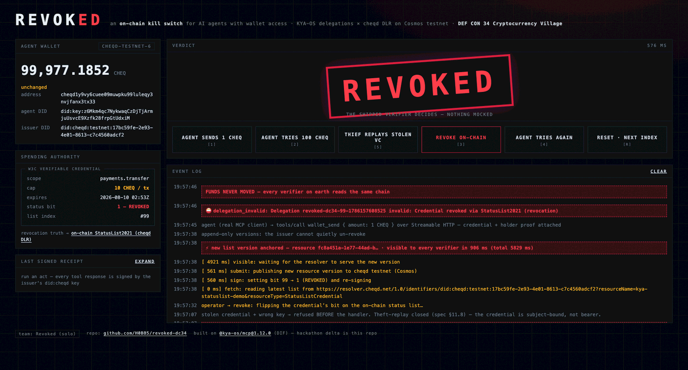

<p align="center">
  <a href="https://kya-os.org">
    <picture>
      <source media="(prefers-color-scheme: dark)" srcset="https://kya-os.org/mcp/images/logo-mark_white.svg">
      
    </picture>
  </a>
</p>

<p align="center">
  <strong>KYA-OS: agent identity, delegation, and proof. This repo is the MCP binding.</strong>
</p>

<p align="center">
  <a href="https://www.npmjs.com/package/@kya-os/mcp"></a>
  <a href="https://kya-os.org/mcp"></a>
  <a href="https://identity.foundation/working-groups/trusted-agents.html"></a>
  <a href="./LICENSE"></a>
</p>

---

## What KYA-OS is

**KYA-OS** (Know Your Agent Operating System) is an identity, authority, and accountability layer that other agent-facing protocols adopt, so that any time an agent acts you can verify *who* called (agent identity), *under what authority* (delegation chain rooted at a Responsible Party, plus consent where required), and *what they did* (signed proofs composing into audit trails).

The shape of the contribution is roughly analogous to TLS. TLS is not a transport, it is a security layer that transports adopt. KYA-OS is not a transport or a runtime, it is an identity and accountability layer that host protocols embed.

Three jobs, six primitives:

- **Identity.** Every agent and every server holds a Decentralized Identifier (`did:key`, `did:web`): a stable, cryptographically-controlled identifier that the agent can prove it owns, and that credentials can be issued against. Without this, there is nothing to bind authority to or hold accountable.
- **Authority.** W3C Verifiable Credentials carrying scoped, revocable delegation chains rooted at a Responsible Party. Per-tool consent gating for actions that require explicit human approval.
- **Accountability.** Detached JWS proofs over canonicalized request/response hashes, composing into tamper-evident audit trails. Invisible to the LLM, verifiable by anyone holding the agent's DID.

> **Note on the name.** This protocol was previously known as **MCP-Identity** / **MCP-I**. The rename to KYA-OS reflects the protocol's binding-agnostic scope. See the [`[Unreleased]` entry in `CHANGELOG.md`](./CHANGELOG.md#unreleased) for the full rationale.

## What this repo is

`@kya-os/mcp` is the **MCP binding** of KYA-OS, the reference implementation for [Model Context Protocol](https://modelcontextprotocol.io) servers, and the first binding to ship.

KYA-OS primitives are intended to embed in three kinds of host surface:

1. **Transport bindings.** Wire protocols an agent's calls ride over (e.g. MCP, HTTPS, gRPC, SMTP).
2. **Runtime bindings.** Agent harnesses where the loop runs and tool invocations can be wrapped uniformly.
3. **Manifest / assertion embeddings.** Host formats that already carry signed assertions, where a KYA-OS proof can serve as one assertion type (e.g. C2PA-track content provenance manifests).

The MCP binding ships first because MCP is the most concentrated agent-to-tool RPC surface today. Additional bindings will be specified in the working group as they reach consensus.

The KYA-OS protocol itself is defined in [`SPEC.md`](./SPEC.md). Binding-specific behavior is called out so future bindings can diverge cleanly where they need to.

```
npm install @kya-os/mcp
```

---

## Migrate any MCP server in 2 lines

**Before**, a standard MCP server with no identity or proofs:

```typescript
import { McpServer } from '@modelcontextprotocol/sdk/server/mcp.js';

const server = new McpServer({ name: 'my-server', version: '1.0.0' });

server.registerTool('greet', { description: 'Say hello' }, async (args) => ({
  content: [{ type: 'text', text: `Hello, ${args.name}!` }],
}));
```

**After**, every tool response now carries a signed cryptographic proof:

```typescript
import { McpServer } from '@modelcontextprotocol/sdk/server/mcp.js';
import { withKyaOs, NodeCryptoProvider } from '@kya-os/mcp';  // +1 line

const server = new McpServer({ name: 'my-server', version: '1.0.0' });
await withKyaOs(server, { crypto: new NodeCryptoProvider() }); // +1 line

server.registerTool('greet', { description: 'Say hello' }, async (args) => ({
  content: [{ type: 'text', text: `Hello, ${args.name}!` }],
}));
```

That's it. `withKyaOs` auto-generates an Ed25519 identity, registers the `_kyaos` protocol tool, and wraps the transport so every tool response includes a detached JWS proof in `_meta`. Invisible to the LLM, verifiable by anyone.

> See the full working example: [examples/context7-with-kya-os](./examples/context7-with-kya-os/), a real MCP server (Context7) migrated with exactly 2 lines of code.

---

## Protect tools with human consent

Some tools shouldn't run without a human saying "yes." KYA-OS adds per-tool authorization using W3C Verifiable Credentials:

```typescript
const checkout = kyaos.wrapWithDelegation(
  'checkout',
  { scopeId: 'cart:write', consentUrl: 'https://example.com/consent' },
  kyaos.wrapWithProof('checkout', async (args) => ({
    content: [{ type: 'text', text: `Order placed: ${args.item}` }],
  })),
);
```

When an agent calls `checkout` without a delegation credential, it gets back a `needs_authorization` response with a consent URL. The human approves, a scoped credential is issued, and the agent retries, now authorized.

> Try it yourself: [examples/consent-basic](./examples/consent-basic/) walks through the full consent flow end-to-end.

---

## Turn proofs into a verifiable audit trail

Detached proofs establish origin and bind request/response content. The
`@kya-os/mcp/audit` service composes those proofs and the full authorization
lifecycle into an atomically ordered, signed ledger with RFC 9162 checkpoints,
independent observations, privacy-separated evidence, and offline replay
bundles.

```typescript
import { withKyaOs, NodeCryptoProvider } from '@kya-os/mcp';
import { createAuditTrail } from '@kya-os/mcp/audit';

const audit = createAuditTrail({
  recorder: checkpointRecorderClient, // or createLocalAuditRecorder(...)
  delivery: 'required',
  hasher,
  ledgerId: 'kya:tenant-opaque:prod:primary',
  expectedLedgerEpochId: 'epoch-2026-07',
  tenantRef,
  producer: pairwiseProducerRef,
  sourceId: 'mcp-server-1',
  binding: 'urn:kya-os:audit-binding:mcp:2025-11-25',
  privacy: { classification: 'internal', retentionClass: 'audit-365d' },
  clock: Date,
});

await withKyaOs(server, { crypto: new NodeCryptoProvider(), audit });
```

The MCP adapter records intent, terminal success/failure, denial/challenge,
proof, delegation, authorization, and replay-rejection paths without copying raw
tool arguments or response bodies. Delivery and assurance claims are explicit;
unsafe high-assurance combinations fail at startup.

See [AUDITABILITY.md](./AUDITABILITY.md) for the trust model, provider contracts,
assurance profiles, Checkpoint integration, replay CLI, and production checklist.
Run the local walkthrough with `npm run example:audit-trail`.

---

## Typed, DID-anchored identity: the Entity Card

Proofs answer *what an agent did*. The **Entity Card** answers *who is calling* — a typed, DID-anchored identity (`agent`, `mcp`, `client`, `verifier`, `human`) an entity publishes once and every discovery rail can index. It is claim-minimal: it asserts only identity, type, declared capabilities, and accountability locators. The trust **level** (L1/L2/L3) is never self-claimed — a verifier RECOMPUTES it from evidence. Three ergonomic calls, imported from the published `@kya-os/mcp/card` subpath:

```typescript
import { card, withKyaOsCard, requireProof, InMemoryNonceCache } from '@kya-os/mcp/card';

// 1. BUILD — describe the agent, fluently. No conformanceLevel: a verifier derives it.
const myCard = card({ did: 'did:web:acme.example:agents:pay', entityType: 'agent', name: 'Acme Pay' })
  .capability('search')                                  // L1: bare-string, self-declared
  .attestedCapability('payments.transfer', capabilityVc) // L2: VC-backed
  .accountableTo('did:web:acme.example:org', { via: 'vc_root>del_123' })
  .usesProof()
  .build();

// 2. EMIT — mount the three discovery artifacts (card.json, DID service entry, server.json _meta).
const mount = withKyaOsCard(myCard);
const serverJson = mount.mountServerJson({ name: 'acme-mcp', version: '1.0.0' });

// 3. GUARD — verify a per-request holder-of-key proof, fail-closed.
const nonces = new InMemoryNonceCache();     // ATOMIC replay defense — never hand-roll this seam
const guard = requireProof({
  resolveKey,                                // resolve the signing key from its kid (DID document)
  expectedAudience: 'did:web:acme.example:mcp:server',
  consumeNonceIfFresh: nonces.consume,       // test-AND-set; a replayed nonce is rejected
});

// Pass the EXACT body the client signed (without _meta) plus the _meta that carried the proof.
const { _meta, ...signedBody } = incomingRequest;
const verdict = await guard(signedBody, _meta); // { ok: true, did, level } or a 401-shaped reject
```

Miss the proof, replay a nonce, or tamper the body and `requireProof` fails closed. To go the other direction — DISCOVER and verify another entity's card — use `resolveCard` + `verifyCard` (the verifier recomputes the conformance floor rather than trusting the card).

> Run the full 10-minute path end-to-end: [examples/entity-card](./examples/entity-card/) — `npm run example:entity-card:server` (build → emit → guard, with a valid proof accepted and a replay + tamper rejected) and `npm run example:entity-card` (the discover → resolve → verify walkthrough). See [SPEC-ENTITY-CARD.md](./SPEC-ENTITY-CARD.md) for normative detail.

---

## See it in action

### REVOKED: an on-chain kill switch for AI agents with wallet access

[](https://www.loom.com/share/f32b82a292f14a6c952dba3a0a246e45)

A live agent (Claude Desktop) pays invoices from a testnet wallet under a signed, scoped, revocable credential. When it goes rogue, a FIDO2 hardware touch revokes that credential on a public chain: the StatusList2021 bit flips in a cheqd DID-Linked Resource, and the agent's next transaction is refused in about half a second. Funds never move.

Built in a weekend on this package (2nd place, DEF CON 34 Cryptocurrency Village), and everything the demo had to invent now ships here: the on-chain resolver, the always-fresh revocation checks, the DLR artifact type ([#165](https://github.com/decentralized-identity/kya-os-mcp/pull/165) through [#169](https://github.com/decentralized-identity/kya-os-mcp/pull/169)).

Start with the 60-second path: verify a genuinely revoked credential against the live testnet, zero configuration. **[examples/revoked](./examples/revoked/)**

### Run the example servers

```bash
git clone https://github.com/decentralized-identity/kya-os-mcp.git
cd kya-os-mcp && npm install
bash scripts/demo.sh
```

This starts all example servers and opens [MCP Inspector](https://github.com/modelcontextprotocol/inspector). Connect to any server, call a tool, and inspect the proof in `_meta`:

| Port | Example | What it demonstrates |
|------|---------|---------------------|
| 3001 | [node-server](./examples/node-server/) | Proofs + restricted tools (low-level API) |
| 3002 | [consent-basic](./examples/consent-basic/) | Human consent flow with built-in UI |
| 3003 | [consent-full](./examples/consent-full/) | Production consent UI ([@kya-os/consent](https://www.npmjs.com/package/@kya-os/consent)) |
| 3004 | [context7-with-kya-os](./examples/context7-with-kya-os/) | 2-line migration of a real MCP server |

Also available: [outbound-delegation](./examples/outbound-delegation/) (gateway pattern), [verify-proof](./examples/verify-proof/) (standalone verification), [statuslist](./examples/statuslist/) (revocation lifecycle), [cheqd-dlr](./examples/cheqd-dlr/) (operator DID linkage + DLR publishing).

## Try it against the live server

[](https://github.com/decentralized-identity/kya-os-mcp/actions/workflows/live-probe.yml)

A public reference deployment runs the latest published release, with the identity `did:web:demo-mcp.kya-os.ai`.
Every surface is a plain HTTPS fetch, so no privileged access is needed to check any claim it makes.

| Surface | URL |
|---------|-----|
| MCP endpoint (streamable-http) | `https://demo-mcp.kya-os.ai/mcp` |
| DID document | [/.well-known/did.json](https://demo-mcp.kya-os.ai/.well-known/did.json) |
| Entity Card | [/card.json](https://demo-mcp.kya-os.ai/card.json) |
| Revocation status list | [/status-list](https://demo-mcp.kya-os.ai/status-list) |
| Exactly what is running | [/provenance](https://demo-mcp.kya-os.ai/provenance) |

Connect [MCP Inspector](https://github.com/modelcontextprotocol/inspector) to `https://demo-mcp.kya-os.ai/mcp`, call `vault_read`, and inspect the proof in `_meta`.
Then verify that proof yourself with [examples/verify-proof](./examples/verify-proof/), which resolves the server's `did:web` over the public internet and checks the signature.
A guided browser walkthrough of the same server (valid proof, tamper, replay, stolen key, live revocation, cross-language re-verification) runs at [poc.kya-os.ai](https://poc.kya-os.ai).

The [daily probe](./.github/workflows/live-probe.yml) in CI performs those same read-only checks: it fetches the discovery surfaces, round-trips a real tool call over MCP, and verifies the returned proof against the publicly resolved DID.
The server is operated by a maintainer on pinned releases; this repo does not deploy it, it independently verifies it.

---

## What's under the hood

| Capability | How it works |
|-----------|-------------|
| **Cryptographic identity** | Ed25519 (EdDSA) and P-256 (ES256, FIPS-eligible) key pairs, `did:key` / `did:web` resolution, optional `did:cheqd` resolver support |
| **Entity Card** | Typed, DID-anchored identity: fluent `card()` builder, `requireProof` per-request holder-of-key guard, CIMD OAuth on-ramp (`client_id` ⇄ `did:web`, MCP's default client auth), and `withKyaOsCard` projections that embed into MCP `server.json` / Server Cards (draft SEP-2127), A2A AgentCards, and NANDA AgentFacts |
| **Signed proofs** | Detached JWS over JCS-canonicalized request/response hashes |
| **Delegation credentials** | W3C Verifiable Credentials with scope constraints, rooted at a Responsible Party |
| **Revocation** | StatusList2021 bitstring with cascading revocation |
| **Replay prevention** | Nonce-based handshake with timestamp skew validation |
| **Verifiable auditability** | Typed producer events, authoritative atomic recorder, signed chain receipts, RFC 9162 checkpoints, independent observation, encrypted evidence references, replay bundles, and offline CLI |
| **Extensible** | Bring your own KMS, HSM, nonce cache (Redis, DynamoDB, KV), or DID method |

### Multi-instance deployments

The in-memory defaults are **single-process only**. For a load-balanced /
multi-instance deployment, inject a durable Redis / Durable Object / DB-backed
implementation for **every** runtime-state seam — the nonce cache
(`NonceCacheProvider`) together with the consent stores (`GrantStore`,
`PendingFlowStore`, `SessionStore`) — so replay protection, grants, pending OAuth
flows, and sessions are shared across instances and survive restarts.

---

## Integrations

KYA-OS integrates through typed **seams** — the adapter pattern is the whole
model. Every external dependency is a port with an in-memory or reference
default; bind your own backend, or drop in a shipped adapter. Adding one is
"implement this interface" (or, for a self-contained system, "drop a folder
under `src/integrations/`") — contributions welcome.

| Seam (port) | Reference / default | Bring your own |
| --- | --- | --- |
| DID resolution — `DIDResolver` | `did:key`, `did:web` | `did:cheqd`, custom methods |
| Revocation — `StatusListResolver` | not configured | cheqd StatusList2021 |
| Authorization — `AuthorizationServerAdapter` | `GenericOidcAdapter` (OIDC + PKCE) | Auth0, Okta, your IdP ([example](./examples/authz-inspector/)) |
| State — `GrantStore`, `SessionStore`, `NonceCacheProvider`, `PendingFlowStore` | in-memory | Redis, DynamoDB, KV, Durable Objects, DB ([multi-instance](#multi-instance-deployments)) |
| Audit delivery — `AuditRecorder`, `AuditAnchorProvider` | local recorder | Checkpoint, on-chain anchoring ([AUDITABILITY.md](./AUDITABILITY.md)) |
| Crypto — `CryptoProvider` | Node, WebCrypto | your KMS / HSM |
| Policy — `PolicyEngine` | built-in default | custom engine |

### cheqd: a fully-worked on-chain integration

cheqd is the reference for what filling the seams looks like end to end — one
package binds three at once: DID resolution (`did:cheqd`), revocation (on-chain
StatusList2021), and audit anchoring (DID-Linked Resources). Enabling the
resolver is a small config change:

```typescript
import { cheqdResolver } from '@kya-os/mcp/cheqd';

await withKyaOs(server, {
  crypto,
  delegation: {
    didResolvers: { cheqd: cheqdResolver({ resolverUrl: 'https://resolver.cheqd.net' }) },
  },
});
```

Its full reference (registrar writes, `did:web` <-> `did:cheqd` linkage,
DID-Linked Resource helpers, live testnet E2E) lives in
[src/integrations/cheqd/README.md](./src/integrations/cheqd/README.md); see
[examples/cheqd-dlr](./examples/cheqd-dlr/) for a complete operator flow.

## Links

- [Spec](./SPEC.md) | [Card Profile](./SPEC-ENTITY-CARD.md) | [Changelog](./CHANGELOG.md) | [DIF TAAWG](https://identity.foundation/working-groups/trusted-agents.html) | [npm](https://www.npmjs.com/package/@kya-os/mcp)
- [CONTRIBUTING.md](./CONTRIBUTING.md) | [CONFORMANCE.md](./CONFORMANCE.md) | [SECURITY.md](./SECURITY.md) | [GOVERNANCE.md](./GOVERNANCE.md)

## License

MIT
