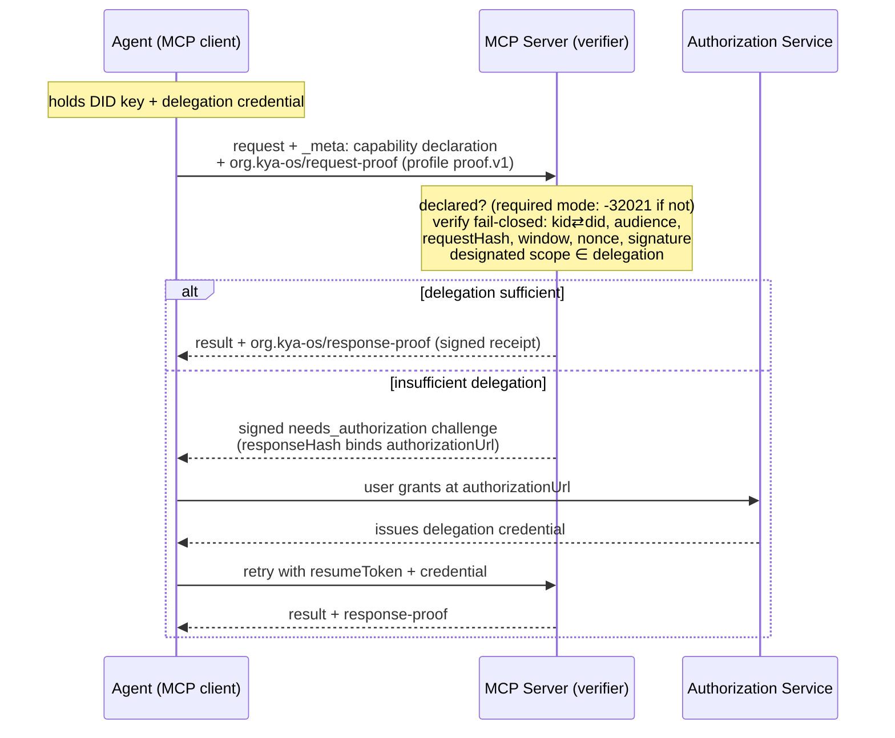

# KYA-OS MCP Extension Binding

**`org.kya-os/decentralized-authority`: agent delegation and per-request proof as an MCP 2026-07-28 extension**

Version: 1.0.0-draft
Status: Draft
Editors: KYA-OS Working Group
Repository: https://github.com/decentralized-identity/kya-os-mcp
Binds: the KYA-OS Protocol Specification ([SPEC.md](./SPEC.md)) and the Entity Card profile ([SPEC-ENTITY-CARD.md](./SPEC-ENTITY-CARD.md)) to the Model Context Protocol Extensions framework (SEP-2133)

---

## Abstract

This document specifies how the KYA-OS protocol operates as an optional, strictly additive extension to the Model Context Protocol, using the Extensions framework introduced in the MCP `2026-07-28` specification (SEP-2133).
The extension is identified as `org.kya-os/decentralized-authority` and is negotiated through the standard `extensions` member of `ClientCapabilities` and `ServerCapabilities`.
It adds no tools, no JSON-RPC methods, no handshake, and no session semantics.
Its entire wire surface is: one capability entry, the reverse-DNS `_meta` keys already registered by the underlying specifications, the `KYA-OS-*` outbound HTTP headers, and the Entity Card discovery projections.
Everything normative about identity, delegation, proofs, and verification is defined in [SPEC.md](./SPEC.md) and [SPEC-ENTITY-CARD.md](./SPEC-ENTITY-CARD.md); this document defines only the MCP binding and is intentionally thin.

---

## Conformance Keywords

The key words "MUST", "MUST NOT", "REQUIRED", "SHALL", "SHALL NOT", "SHOULD", "SHOULD NOT", "RECOMMENDED", "MAY", and "OPTIONAL" in this document are to be interpreted as described in BCP 14 [RFC2119] [RFC8174] when, and only when, they appear in all capitals, as shown here.

---

## 1. Extension Identity and Versioning

### 1.1 Identifier

The extension identifier is:

```
org.kya-os/decentralized-authority
```

The vendor prefix `org.kya-os` is the reverse-DNS form of `kya-os.org`, which the KYA-OS project controls.
The identifier follows the SEP-2133 `{vendor-prefix}/{extension-name}` form.
The name states the extension's distinguishing property: the authority it conveys (identity, delegation chains, per-request proofs, and their audit trail) verifies locally from signed artifacts, with no round trip to a central authorization service (§13.2).
The identifier was settled in DIF TAAWG discussion (2026-07-28).

### 1.2 Versioning

The extension version is carried in the negotiation settings object (§3.2) and versions independently of both the MCP specification and the underlying KYA-OS protocol version.
Per SEP-2133, a breaking change to this extension requires a **new extension identifier**; the `1.x` line of this document is therefore strictly additive.

### 1.3 Graduation

If this extension is later accepted as an official MCP extension, its identifier would move under the reserved `io.modelcontextprotocol/` prefix.
The underlying specifications anticipate this: the proof placement key is a single configurable constant (`proofMetaKey`, SPEC.md §7.6), so re-pointing the identifier and keys is a configuration change, not a wire redesign.
Re-keying of the `_meta` registry entries (§2.2) would be specified by a successor revision of this document under the new identifier.

---

## 2. What the Extension Adds to the Wire

### 2.1 Surface summary

| Surface | Mechanism | Defined in |
|---|---|---|
| Capability negotiation | `capabilities.extensions["org.kya-os/decentralized-authority"]` settings object | §3 (this document) |
| Request proof | `_meta["org.kya-os/request-proof"]` per-request holder-of-key proof | SPEC-ENTITY-CARD §8 |
| Response proof / audit | `_meta["org.kya-os/response-proof"]` detached response proof | SPEC.md §7 |
| Consent step-up | signed `needs_authorization` challenge | SPEC.md §9 |
| Delegated authority | W3C VC delegation chains, referenced via `delegationRef` | SPEC.md §6, §6.10 |
| Gateway propagation | `KYA-OS-*` outbound HTTP headers; body-free routing | SPEC.md §8 |
| Discovery | Entity Card + projections; `/.well-known/mcp`; `server/discover` | SPEC-ENTITY-CARD §5-§6; SPEC.md §10; §3.4 (this document) |

The extension defines **no tools** and **no new JSON-RPC methods**.
The `_kyaos_handshake` tool and the KYA-OS session lifecycle (SPEC.md §5, §14) are **not part of this extension**; they are the legacy 1.x session profile, retained as an optional application-layer convenience outside the negotiated surface (see §11 and SPEC-ENTITY-CARD §15.5, Appendix D.4).

### 2.2 `_meta` keys

The reverse-DNS `_meta` keys used by this extension are the keys registered in SPEC-ENTITY-CARD §14.1:

| Key | Carries | Direction |
|---|---|---|
| `org.kya-os/request-proof` | the self-contained per-request holder-of-key proof of the `org.kya-os/proof.v1` profile (SPEC-ENTITY-CARD §8; the legacy key and `prf` value `org.kya-os/proof@1` are accepted for one major version) | request (caller to server) |
| `org.kya-os/response-proof` | the detached response proof (SPEC.md §7), including signed `needs_authorization` challenges; previously `org.kya-os/proof`, read-accepted for one major version | response (server to caller) |
| `org.kya-os/card` (and nested `org.kya-os/cardRef`) | inline Entity Card summary or lazy card reference on discovery documents | discovery |
| `org.kya-os/did` | the Entity's DID inside a CIMD document | discovery |

These keys coexist with the MCP-reserved `io.modelcontextprotocol/*` keys and the W3C Trace Context keys (`traceparent`, `tracestate`, `baggage`) under the coexistence rules of SPEC.md §7.6.
A KYA-OS verifier MUST NOT reject a message because `_meta` carries foreign namespaced keys, and MUST NOT include any non-KYA-OS `_meta` key in a hash or signature computation (SPEC.md §7.6).

The full request cycle, including the consent step-up that issues a delegation credential:



---

## 3. Capability Negotiation

### 3.1 Where the declaration travels

MCP `2026-07-28` is stateless: there is no `initialize` handshake, and the client's capabilities travel on **every request** in `_meta["io.modelcontextprotocol/clientCapabilities"]` (SEP-2575).
A client that supports this extension declares it inside that object's `extensions` member:

```json
{
  "method": "tools/call",
  "params": {
    "name": "read_file",
    "arguments": { "path": "/etc/hosts" },
    "_meta": {
      "io.modelcontextprotocol/protocolVersion": "2026-07-28",
      "io.modelcontextprotocol/clientCapabilities": {
        "extensions": {
          "org.kya-os/decentralized-authority": {
            "version": "1.0.0",
            "proofProfiles": ["org.kya-os/proof.v1"],
            "didMethods": ["did:key", "did:web"]
          }
        }
      },
      "org.kya-os/request-proof": { "prf": "org.kya-os/proof.v1", "...": "see SPEC-ENTITY-CARD §8.2" }
    }
  }
}
```

A server declares the extension in the `capabilities.extensions` member of its `server/discover` result (SEP-2575 requires servers to implement `server/discover`):

```json
{
  "resultType": "complete",
  "supportedVersions": ["2026-07-28"],
  "capabilities": {
    "extensions": {
      "org.kya-os/decentralized-authority": {
        "version": "1.0.0",
        "proofProfiles": ["org.kya-os/proof.v1"],
        "didMethods": ["did:key", "did:web"],
        "required": true
      }
    }
  }
}
```

For peers on the `2025-11-25` protocol, the same settings object is carried in the initialize-era `capabilities.extensions` field; implementations supporting both protocol versions MUST normalize the two carriage forms into one internal declaration.
Note that the `extensions` member is not defined by the `2025-11-25` schema (it was added in `2026-07-28`); on that revision it travels as an additive member that peers tolerate under MCP's unknown-member rules, matching the carriage MCP's extensions documentation demonstrates for initialize-era versions.

### 3.2 The settings object

The settings object is defined normatively by [`schemas/mcp-extension-settings.json`](./schemas/mcp-extension-settings.json) (JSON Schema 2020-12).
All members are OPTIONAL; per SEP-2133, an **empty object** (`{}`) means "supported, with default configuration".

| Member | Type | Meaning |
|---|---|---|
| `version` | string (semver) | The extension-document version the peer implements. Default `"1.0.0"`. |
| `proofProfiles` | array of strings | Proof profiles the peer can mint (client) or verify (server). Default `["org.kya-os/proof.v1"]`. |
| `didMethods` | array of strings (`did:` method ids) | DID methods the peer uses (client) or resolves (server). Default `["did:key", "did:web"]`; `did:cheqd` is opt-in per SPEC.md §4.4.1. |
| `required` | boolean | Server-side only: whether the server rejects requests from clients that do not declare this extension (§4). Default `false`. Clients MUST ignore this member if present on a client declaration. |

Unknown members MUST be ignored (forward compatibility).
A peer that receives a malformed settings object MUST treat the declaration as absent (fail closed to non-declaration, §4), not guess at intent.

### 3.3 Meaning of a declaration

A **client** declaration asserts: the client can mint proofs under at least one listed profile, attaches them under the corresponding `_meta` key, and understands this extension's error surface (§5) and signed challenges (§7).
A declaring client SHOULD attach a proof to every request it wants authorized under KYA-OS semantics; the underlying specifications define what an unproven request means to a given server policy.

A **server** declaration asserts: the server verifies proofs under the listed profiles per the fail-closed algorithm of SPEC-ENTITY-CARD §11, and (when `required` is `true`) enforces declaration as a precondition (§4).

### 3.4 Discovery before first call

A client MAY call `server/discover` before any other request to learn whether a server speaks, and whether it requires, `org.kya-os/decentralized-authority`, and attach proofs from the first real request onward.
The `/.well-known/mcp` document (SPEC.md §10) and the Entity Card projections (SPEC-ENTITY-CARD §6) advertise the same facts out of band; `server/discover` is the in-protocol source of truth under `2026-07-28`.

---

## 4. Graceful Degradation and Required Mode

### 4.1 Optional mode (`required` absent or `false`)

When the server does not require the extension:

- A request from a client that did not declare the extension is processed as core MCP.
  No proof is demanded and no KYA-OS error is emitted.
- A request from a declaring client is verified when a proof is present; the server's policy decides whether an unproven request from a declaring client is treated as core traffic or gated (SPEC-ENTITY-CARD Appendix D.2).

### 4.2 Required mode (`required: true`)

When the server requires the extension, a request whose `_meta["io.modelcontextprotocol/clientCapabilities"]` does **not** declare `org.kya-os/decentralized-authority` MUST be rejected with the core MCP error:

```json
{
  "jsonrpc": "2.0",
  "id": 7,
  "error": {
    "code": -32021,
    "message": "Missing required client capability: org.kya-os/decentralized-authority",
    "data": {
      "requiredCapabilities": { "extensions": { "org.kya-os/decentralized-authority": {} } },
      "reason": "extension_not_declared",
      "extension": "org.kya-os/decentralized-authority"
    }
  }
}
```

`-32021` is `MissingRequiredClientCapabilityError`, defined by the MCP `2026-07-28` core specification for exactly this condition; this extension uses it and allocates no numeric code of its own for the case.
`requiredCapabilities` is the core schema's payload for this error; `reason` is this extension's dispatch code (§5.2).
Where an SDK's typed error reconstruction surfaces only `requiredCapabilities`, membership of this extension's id in `requiredCapabilities.extensions` is the fallback discriminant.

Required mode MUST NOT gate `server/discover`: the pre-flight discovery of §3.4 has to remain reachable by non-declaring clients, or a client could never learn the requirement it fails.
Implementations SHOULD extend the same exemption to liveness pings from earlier protocol revisions.

### 4.3 Stripped declarations are absent declarations

`params._meta` is excluded from the proof's request hash by design (SPEC-ENTITY-CARD §8.3), so `_meta` content, including the capability declaration, is intermediary-mutable and unauthenticated.
The safety property is therefore fail-closed handling of absence, never silent acceptance:

- required mode answers a missing or stripped declaration with `-32021` (§4.2);
- optional mode degrades a missing or stripped declaration to core behavior (§4.1);
- a missing or stripped **proof** on a gated call is rejected by the proof gate (`proof_missing`, §5.2), regardless of what the declaration said;
- a stripped proof `cnf` in the presence of a token `cnf` fails closed (`cnf_required_by_token`, SPEC-ENTITY-CARD §8.6, §12.7).

Nothing security-relevant may ever be trusted from `_meta` without verifying the signed artifact it carries.

---

## 5. Error Surface

### 5.1 Numeric code policy

MCP `2026-07-28` partitions the JSON-RPC server-error range: `-32000` to `-32019` is legacy (new codes MUST NOT be allocated there, and new implementations SHOULD NOT use codes from that sub-range at all), and `-32020` to `-32099` is reserved for the MCP specification (which defines `-32020` `HeaderMismatchError`, `-32021` `MissingRequiredClientCapabilityError`, and `-32022` `UnsupportedProtocolVersionError`).
New codes for purposes the core specification does not define SHOULD be allocated outside the JSON-RPC reserved range (`-32768` to `-32000`) entirely.
This extension:

- uses core `-32021` exclusively for the undeclared-required-capability case (§4.2);
- MUST NOT allocate extension-specific codes inside the MCP-reserved `-32020` to `-32099` range;
- allocates its default domain code outside the JSON-RPC reserved range (`-31000` in the reference implementation);
- carries its own failure taxonomy in `error.data`, not in numeric codes.

### 5.2 KYA-OS reason codes ride `error.data.reason`

KYA-OS failure codes are snake_case strings, defined in SPEC-ENTITY-CARD Appendix D (current profile) and SPEC.md Appendix A (legacy session profile).
When a KYA-OS failure surfaces as a JSON-RPC error, the error's numeric `code` is implementation-defined and allocated per §5.1, and `error.data` MUST carry the KYA-OS code verbatim:

```json
{
  "jsonrpc": "2.0",
  "id": 8,
  "error": {
    "code": -31000,
    "message": "KYA-OS proof required",
    "data": {
      "reason": "proof_missing",
      "profile": "org.kya-os/proof.v1"
    }
  }
}
```

Clients MUST dispatch on `error.data.reason`, never on the implementation-defined numeric code.
The proof-gate codes are `proof_missing`, `proof_invalid`, and `proof_level_insufficient` (SPEC-ENTITY-CARD Appendix D.2); fine-grained verification reasons (Appendix D.1) MAY additionally be surfaced under `error.data.reasons` for diagnostics.
No new numeric codes are invented for any Appendix D code.
This document defines exactly one reason code of its own: `extension_not_declared`, emitted only inside the `data` member of a core `-32021` error (§4.2); every other reason code this extension surfaces is defined by SPEC-ENTITY-CARD Appendix D or SPEC.md Appendix A.

### 5.3 HTTP-layer failures

Deployments that gate at an HTTP edge (SPEC.md §8.4) keep their HTTP semantics (401/403 with the same snake_case codes); this section governs only the JSON-RPC surface.

---

## 6. Request Proof Binding

The request proof is `org.kya-os/proof.v1`, specified normatively in SPEC-ENTITY-CARD §8 and verified per the exact fail-closed order of SPEC-ENTITY-CARD §11.2.
The MCP-specific deltas are only these:

1. **Placement.** The proof object rides `_meta["org.kya-os/request-proof"]` inside `params` of the JSON-RPC request - the role-named carrier of the `org.kya-os/proof.v1` profile (SPEC-ENTITY-CARD §8.1; the legacy key and `prf` value `org.kya-os/proof@1` are accepted for one major version).
2. **Request binding.** `requestHash` covers `{ method, params }` with `params._meta` removed (SPEC-ENTITY-CARD §8.3).
   Consequently an intermediary MAY add or rewrite `_meta` members (for example the required `io.modelcontextprotocol/*` keys) without invalidating the proof, and MUST NOT mutate `method` or any other part of `params` on a proof-bearing request, because any such mutation invalidates `requestHash`.
3. **Transport agnosticism.** The proof is in-band JSON-RPC and verifies identically over stdio and Streamable HTTP; the OPTIONAL RFC 9421 sibling (SPEC-ENTITY-CARD §8.5) serves HTTP-edge intermediaries.
4. **Relationship to DPoP.** SPEC-ENTITY-CARD §8.8 governs; the two compose and are not alternatives.

Response-side proofs (SPEC.md §7) cover the response body only: response canonicalization is the `data` field, excluding `_meta` (SPEC.md §7.3, which the reference implementation follows exactly).
Under MCP `2026-07-28` every result carries a `resultType` member (SEP-2322).
`resultType` is NOT covered by `responseHash`: result members outside the body (`resultType`, `isError`, `structuredContent`) are unauthenticated, and clients MUST NOT treat them as proof-covered.
A future MRTR profile (§7.3) would have to extend `responseHash` coverage to `resultType` and `inputRequests` before the consent flow could ride `input_required`.

---

## 7. Delegation, Authority, and Consent

### 7.1 Delegated authority

Authority is conveyed only by a verifiable delegation chain: the W3C VC model of SPEC.md §6, including the VC 2.0 + ZCAP-LD profile of SPEC.md §6.10, with the designation invariant (SPEC.md §6.4.1), revocation (SPEC.md §6.5-§6.6, SPEC-ENTITY-CARD §10.3), and the recomputed accountability joins (SPEC-ENTITY-CARD §10.2).
A proof references its authority via `delegationRef`; declaring the extension conveys no authority by itself.

### 7.2 Consent step-up

The step-up flow is SPEC.md §9: a call lacking sufficient delegation returns a `needs_authorization` challenge whose content, including `authorizationUrl`, is bound by a signed response proof (`outcome: "needs_authorization"`, SPEC.md §7.4, §9.2).
A client MUST verify the challenge proof and recompute `responseHash` over the received challenge before directing a user to `authorizationUrl` (SPEC.md §9.3), and MUST apply the RFC 9207 issuer validation of SPEC.md §9.4 on the authorization callback.
This document binds the challenge carriage: a server delivers the SPEC.md §9.2 challenge object as the body of a `resultType: "complete"` result, so the proof's `responseHash` covers the challenge content (SPEC.md §7.3, §7.4) while the result's `resultType` member itself remains outside proof coverage (§6).

### 7.3 Relationship to Multi Round-Trip Requests (informative)

MCP `2026-07-28` introduces the Multi Round-Trip Request pattern (SEP-2322): a server returns `resultType: "input_required"` with `inputRequests`, and the client retries the original request carrying `inputResponses`.
The KYA-OS step-up flow is structurally the same shape: challenge out, user action, retry with `resumeToken` and a fresh delegation (SPEC.md §9.3).
This revision carries the challenge as the body of a `resultType: "complete"` result (§7.2, this document's own binding decision; SPEC.md §9.2 defines the challenge object without a carriage statement) and does not profile it onto `input_required`, because the underlying specification defines the retry as a new request rather than an MRTR continuation.
A future revision MAY define an MRTR profile of the consent flow; such a profile would be additive and negotiated through the settings object.

---

## 8. Gateways and Intermediaries

Outbound delegation propagation uses the `KYA-OS-*` header registry and trust tiers of SPEC.md §8.1 and the delegation proof JWT of SPEC.md §8.2; the Verifiable Credential is authoritative and advisory headers are never authorization inputs.
Under MCP `2026-07-28`, Streamable HTTP requests carry the `Mcp-Method` and `Mcp-Name` routing headers (SEP-2243), and a KYA-OS-aware gateway MAY route and pre-authorize body-free per SPEC.md §8.4; the origin server remains responsible for full verification.

Intermediaries handling proof-bearing requests inherit the constraint of §6 item 2: additions confined to `params._meta` are safe; any mutation of covered request material invalidates the proof by construction.

---

## 9. Discovery

Discovery is the Entity Card layer, unchanged by this document:

- the canonical, DID-anchored `card.json` and its `KyaOsEntityCard` service anchor (SPEC-ENTITY-CARD §5);
- the projections onto MCP `server.json` / `catalog.json` `_meta["org.kya-os/card"]`, A2A `AgentExtension`, and NANDA `AgentFacts` (SPEC-ENTITY-CARD §6), with every outbound fetch through SafeFetch (SPEC-ENTITY-CARD §6.6);
- the CIMD on-ramp binding `client_id` to `did:web` (SPEC-ENTITY-CARD §7);
- the `/.well-known/mcp` document (SPEC.md §10).

This extension adds one in-protocol surface: the `server/discover` capability advertisement (§3.1), which lets a client learn the server's KYA-OS posture before the first tool call.
There is no `/.well-known/kya-os-identity` endpoint.

---

## 10. Security Considerations

The security models of SPEC.md §11 and SPEC-ENTITY-CARD §12 apply in full and are not restated.
Extension-specific considerations:

1. **Capability-map downgrade.** The declaration is unauthenticated `_meta` (§4.3).
   A required-mode server answers absence with `-32021`; an optional-mode server degrades to core behavior; neither ever silently accepts a stripped-but-required declaration as authorized traffic.
   The load-bearing artifacts are the signed proof and credentials, never the declaration.
2. **`_meta` coexistence.** Verifiers follow SPEC.md §7.6: only KYA-OS keys are read, nothing else in `_meta` is hashed, trusted, or a cause for rejection.
   Handlers MUST NOT derive authorization-relevant behavior from unsigned `_meta` members.
3. **Token-passthrough non-interference.** This extension never reads or writes the HTTP `Authorization` header.
   OAuth token acquisition and hardening (SPEC.md §9.4, §15.1) remain the token layer; KYA-OS remains the authority layer; the core MCP token-passthrough prohibition is untouched.
4. **Replay containment scope.** Proof construction is stateless; verification is not (SPEC-ENTITY-CARD §8).
   Accept-once nonce enforcement is per nonce-store visibility scope: a verifier without a nonce seam MUST fail closed (`nonce_seam_missing`, SPEC-ENTITY-CARD §11.2 step 8), and multi-replica deployments MUST use an atomic, shared or replica-sticky nonce store (SPEC-ENTITY-CARD §12.2) if duplicate execution of a byte-identical request inside the 60-second window is unacceptable.
   The same bound applies to any stateless-verification scheme, including DPoP server-side `jti` tracking (RFC 9449).
5. **Verification cost and revocation freshness.** Warm-path verification is local CPU only (signature checks plus JCS hashing); cold paths add DID document and status-list fetches through SafeFetch.
   Revocation staleness is bounded by status-cache TTL, with short TTLs (60 seconds or less) recommended for high-privilege scopes (SPEC.md §6.5.2, §11.10); this is the same trade OAuth makes through token lifetime, relocated to a cache knob.

---

## 11. Privacy Considerations

The privacy considerations of SPEC.md §12 and SPEC-ENTITY-CARD §13 apply in full.
Extension-specific considerations:

1. **Correlation.** A stable agent DID plus per-request signed proofs makes an agent's activity linkable across every server it touches, and non-repudiable indefinitely.
   That is the explicit goal of enterprise audit deployments and a real cost elsewhere.
   Implementations SHOULD support pairwise (per-audience) agent DIDs (SPEC.md §12.1, SPEC-ENTITY-CARD §13), and this extension does NOT require a globally stable DID for conformance.
2. **Chain disclosure.** Delegation credentials identify delegating principals to every chain verifier.
   Issuers SHOULD prefer opaque, organization-resolvable subject identifiers over human-readable ones, and deployments SHOULD present chains pruned to the minimum depth that preserves the authority argument (see also per-delegation keys, SPEC.md §12.5).
3. **Cards are claim-minimal.** Discovery projections carry no principal PII (SPEC-ENTITY-CARD §4.2, §13); optional fields are omitted, not nulled.
4. **Status-list fetches.** A status fetch reveals verifier interest to the status host; verifiers SHOULD fetch whole lists (herd privacy) rather than per-index queries, and cache per §10 item 5.
5. **Retention.** Proofs are designed to verify later; stores holding them are linkable records.
   Deployments SHOULD define retention windows, distinguish audit-grade retention from transient verification, and discard transient proofs after the replay window (SPEC.md §12.4).

---

## 12. Backward Compatibility

1. **Unaware peers.** A peer that ignores this extension gets core MCP behavior end to end; every KYA-OS surface is additive `_meta`, headers, or discovery documents that the graceful-degradation contracts (§4, SPEC-ENTITY-CARD §6) cover.
2. **`2025-11-25` peers.** The declaration is carried in the initialize-era `capabilities.extensions` field, as an additive member that revision's schema does not define (§3.1); proofs and errors are unchanged.
3. **Legacy 1.x session profile.** The `_kyaos_handshake` tool, KYA-OS sessions, and the session-bound proof under `_meta["org.kya-os/response-proof"]` (historically `org.kya-os/proof`) remain valid 1.x behavior outside this extension (SPEC.md §5, §14; SPEC-ENTITY-CARD §8.1, §15.5, Appendix D.4).
   The two proof eras ride distinct keys and coexist on one server; the session profile is expected to be deprecated at KYA-OS 2.0 in favor of the self-contained profile.
4. **Legacy bare `proof` key.** The one-major-version acceptance window for the bare `proof` response key is governed by SPEC.md §7.6, which is the single authoritative statement of that window; producers SHOULD emit only namespaced keys.

---

## 13. Rationale (informative)

### 13.1 Why this lane is empty

The MCP `2026-07-28` authorization work hardens **user-level OAuth**: protected-resource metadata, resource indicators, issuer validation, and Client ID Metadata Documents.
The `ext-auth` extensions govern **enterprise session authorization** (Enterprise-Managed Authorization) and **workload client credentials**.
None of these answer: *which agent is acting, under what verifiable delegated authority, with what per-request, third-party-verifiable proof?*
That question is this extension's entire scope, and it composes with, rather than replaces, the OAuth layers: CIMD is the shared on-ramp (SPEC-ENTITY-CARD §7), tokens stay sender-constrained via `cnf.jkt` fusion (SPEC-ENTITY-CARD §8.6), and the `Authorization` header is never touched (§10 item 3).

### 13.2 OAuth-rails comparison

An honest comparison against composing DPoP (proof-of-possession), Workload Identity Federation (workload identity), and RFC 8693 token exchange (delegation-ish nesting):

| Capability | DPoP + WIF + RFC 8693 | `org.kya-os/decentralized-authority` | Honest call |
|---|---|---|---|
| Per-request proof-of-possession | Yes (HTTP-bound `htm`/`htu`) | Yes (JSON-RPC-bound `requestHash`) | Tie on mechanism; this profile binds the operation, DPoP binds the HTTP envelope; they compose via `cnf.jkt` (SPEC-ENTITY-CARD §8.6, §8.8). |
| Workload/client identity | Yes, mature IdP federation | Yes (DID + Entity Card) | OAuth rails win on enterprise IdP maturity and reviewer familiarity. |
| Verification without an AS round trip | No; validity and exchange are AS-mediated | Yes; signature + chain verify locally, only revocation freshness fetches | KYA-OS's strongest row: gateways on a latency budget, edge and air-gapped deployments, agent-to-agent hops with no shared AS. |
| Cross-domain portability | Pairwise federation configuration per domain pair | The chain carries its own authority; any verifier with a trust-root policy can verify | KYA-OS, stated precisely: no pre-established pairwise trust, not "no trust configuration". |
| Delegation chains with per-hop narrowing | Partially; `act` claims nest, but chain semantics are unstandardized and AS-coupled | Native: subset, narrowing, continuity, and depth invariants enforced at verify time (SPEC.md §6.10) | KYA-OS; this is the core differentiator. |
| Post-hoc third-party verifiability (audit) | Opaque; the AS log is the record | Non-repudiable signed artifacts, verifiable by anyone with the public keys, indefinitely | KYA-OS; the enterprise-audit wedge (see also SPEC.md §15.3), and the privacy cost §11 addresses. |
| Instant revocation | AS-centralized; staleness bounded by token lifetime | Status list; staleness bounded by cache TTL | Roughly a tie with different knobs; neither eliminates the race (SPEC.md §6.5.2). |
| Library ubiquity | Ubiquitous | Niche; DID/VC tooling is a real import cost | OAuth rails win; the mitigations are the two shipped implementations and the cross-language conformance harness (SPEC-ENTITY-CARD Appendix C). |

### 13.3 Fit with the 2026-07-28 core

The stateless core made per-request, self-contained verification the only identity model that works on any replica; that is what `org.kya-os/proof.v1` already is.
The deprecation of core Logging, alongside standardized trace-context `_meta`, moves audit concerns toward extensions; KYA-OS's proof and auditability layers (SPEC.md §7, §15.3) are that story for agent actions.

---

## 14. References

### Normative

- [SPEC.md](./SPEC.md), the KYA-OS Protocol Specification, v1.0.0.
- [SPEC-ENTITY-CARD.md](./SPEC-ENTITY-CARD.md), the KYA-OS Entity Card profile, v1.1.
- [`schemas/mcp-extension-settings.json`](./schemas/mcp-extension-settings.json), the negotiation settings schema.
- Model Context Protocol, specification revision `2026-07-28` (Release Candidate; verified against the `draft` revision, 2026-07-28). https://modelcontextprotocol.io/specification/draft, expected to publish as https://modelcontextprotocol.io/specification/2026-07-28
- SEP-2133, *Extensions framework for MCP*. https://github.com/modelcontextprotocol/modelcontextprotocol/pull/2133
- **[RFC2119]** / **[RFC8174]** BCP 14 conformance keywords.

### Informative

- SEP-2575 (stateless core, `server/discover`), SEP-2567 (session removal), SEP-2322 (Multi Round-Trip Requests, `resultType`), SEP-2243 (`Mcp-Method`/`Mcp-Name`), SEP-414 (trace context `_meta`), SEP-2577 (deprecations), via the MCP changelog (verified against the `draft` revision, 2026-07-28). https://modelcontextprotocol.io/specification/draft/changelog
- **[RFC9449]** OAuth 2.0 Demonstrating Proof of Possession (DPoP).
- **[RFC9207]** OAuth 2.0 Authorization Server Issuer Identification.
- MCP `ext-auth` extensions (Enterprise-Managed Authorization; OAuth Client Credentials). https://github.com/modelcontextprotocol/ext-auth
