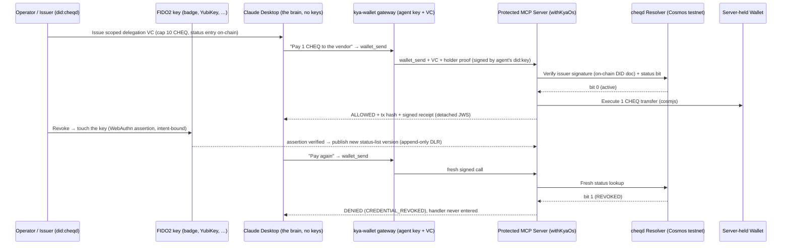
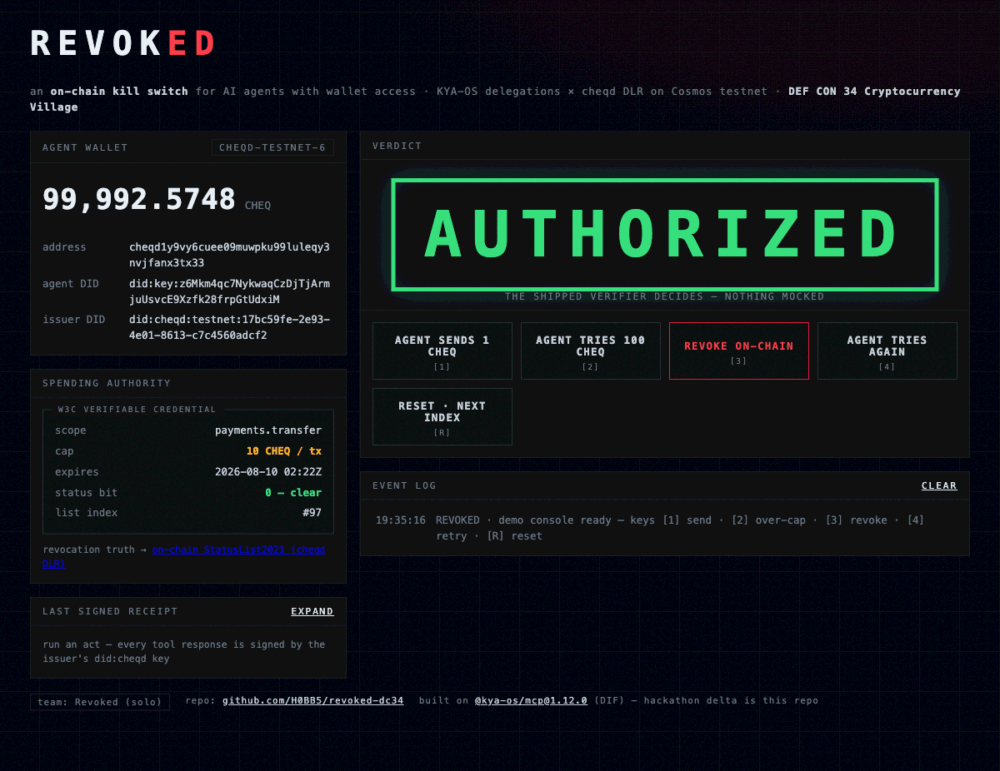
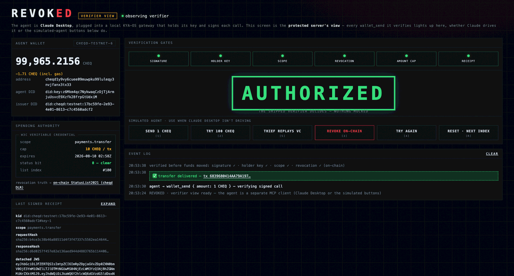
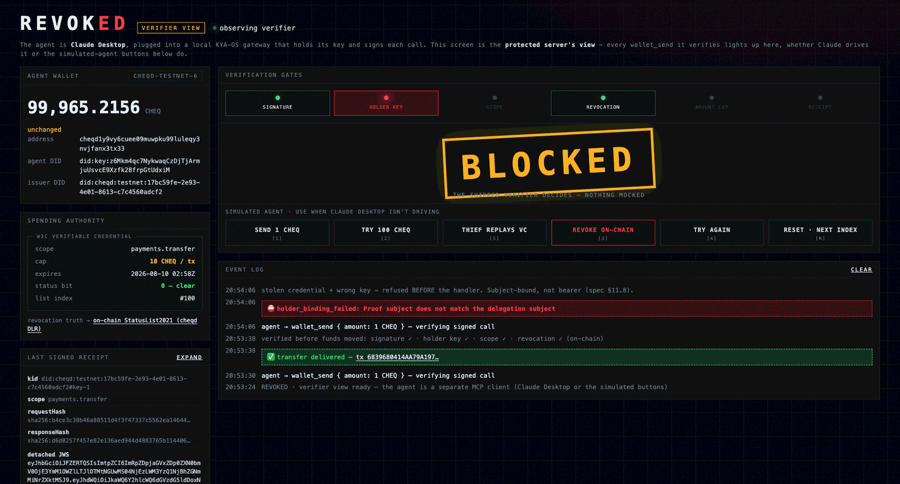
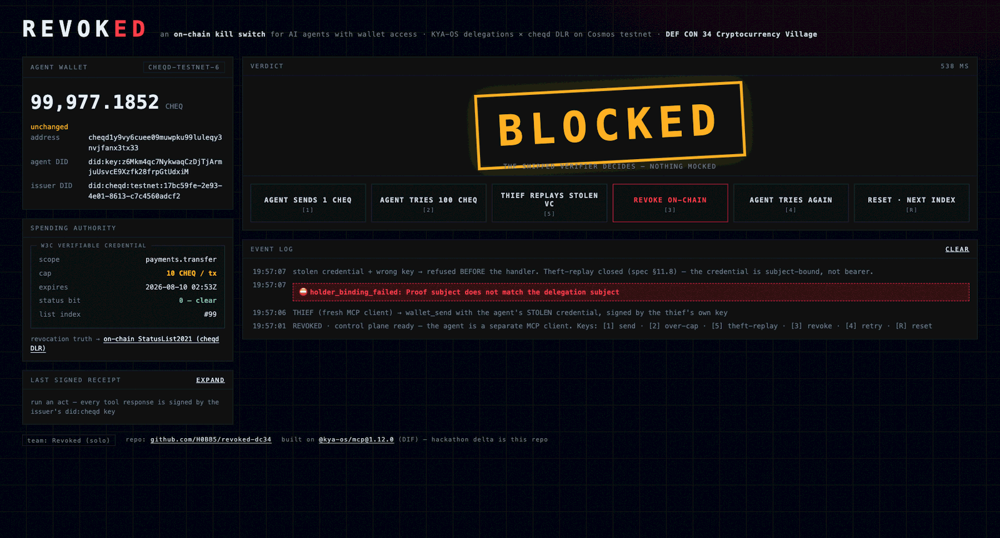
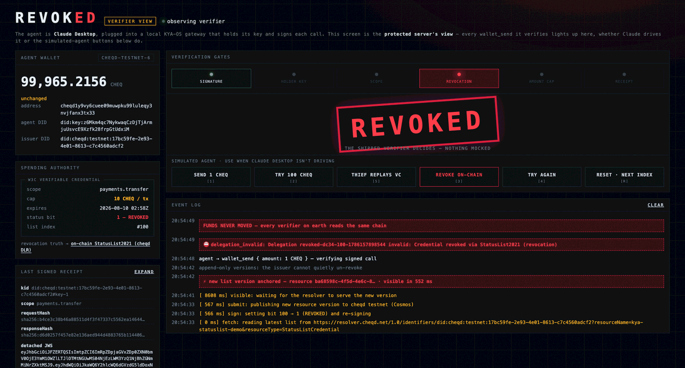

# REVOKED: an on-chain kill switch for AI agents with wallet access

**Built solo in a weekend at DEF CON 34 (2nd place, Cryptocurrency Village hackathon). Now the flagship example of this reference implementation.**

> Agents spend under cryptographically scoped, verifiable delegations, and that
> spending authority can be revoked on a public chain. A rogue or hijacked agent
> is stopped before it drains a wallet, with no server anyone has to trust.

[](https://www.loom.com/share/f32b82a292f14a6c952dba3a0a246e45)

*Click through for the 3-minute video: a live agent pays an invoice, gets caught misbehaving, and loses its spending authority on-chain. Its next transaction is refused in about half a second.*

## Try it in 60 seconds (zero configuration)

A genuinely revoked credential is anchored on cheqd testnet right now. Verify it yourself:

```bash
cd examples/revoked
npm install
npm run verify:once
```

No keys, no environment variables, no trusting this repo's word for it. The shipped `DelegationCredentialVerifier` runs the full pipeline live: it resolves the issuer's DID document from the chain, verifies the status list's Ed25519 signature against it, checks purpose parity, and reads the revocation bit. Expected output:

```json
{
  "verdict": "CREDENTIAL_REVOKED",
  "checks": { "basicValid": true, "signatureValid": true, "statusValid": false },
  "elapsedMs": 828
}
```

The signature is real, the credential is unexpired, and the chain still refuses it. That refusal is the product.

Also bundled: `samples/delegation-94.json`, the actual credential from the DEF CON stage. Its 48-hour validity is long gone, so `npm run verify:once -- --index 94` shows expiry beating revocation to the refusal. Fail-closed has layers.

## What you're looking at

The agent is **Claude Desktop**, the same MCP client thousands of people use, plugged into a local `kya-wallet` gateway that holds the agent's key and signs each call. The LLM never touches key material. The console is the verifier's view; the wallet never leaves the server. No Claude Desktop on hand? `npm run agent` and the console's simulated-agent buttons drive the exact same path.



## The beats

1. **The agent spends, safely.** It presents its W3C Delegation Credential (scope `payments.transfer`, capped at 10 CHEQ per transfer; the cap lives in the signed credential, not in app code) plus a per-request holder proof signed by its own did:key. The server runs `holderBinding: 'enforce'`, so the credential is subject-bound, not bearer. Real CHEQ moves on testnet, and every response carries a detached-JWS receipt.
2. **Attack theater.** An over-cap send fails with `SCOPE_CONSTRAINT_VIOLATED`, read from the credential. A thief replaying the stolen credential with their own key fails `holder_binding_failed` before the handler is entered.
3. **The kill.** A FIDO2 touch authorizes the revocation. The WebAuthn challenge is the SHA-256 of the canonical revocation intent, so the assertion is bound to this exact revocation, not a generic login. A new status-list version publishes as an append-only DID-Linked Resource: the issuer cannot quietly un-revoke, and every verifier reads the same chain.
4. **After the kill.** The agent can still read the public balance. It cannot move a token: `CREDENTIAL_REVOKED`, refused before the handler runs.

## Run the full demo

Tiered on purpose. Each tier stands alone.

### Tier 1: the console (your own issuer, testnet)

One-time setup, then the show:

```bash
cp .env.example .env.local        # fill in as each step below tells you
npm run gen:accounts              # agent + fee wallets (fund via the cheqd testnet faucet)
npm run create:did                # your issuer did:cheqd on testnet
npm run publish:statuslist        # anchor the all-clear status list as a DLR
npm run issue:delegation          # mint the scoped, capped, revocable credential
npm run serve                     # protected server + verifier console
```

Open the console, press `[1]` send / `[2]` over-cap / `[5]` theft / `[3]` revoke / `[4]` retry. Presenter mode is `P`, high-contrast is `C`.

### Tier 2: a live agent (Claude Desktop)

Copy `docs/claude_desktop_config.json` into your Claude Desktop config and edit the two absolute paths. Claude gets a clean `wallet_send` / `check_balance` tool surface; the gateway holds the did:key and signs every call. Ask Claude to pay an invoice and watch the console light the same six gates.

### Tier 3: the hardware kill switch

Any FIDO2 authenticator works. The DEF CON badge was the stage prop; a YubiKey does the same job.

```bash
BADGE_SETUP=1 npm run serve       # then open /badge-setup.html and register the key
BADGE_WEBAUTHN=1 npm run serve    # revocation now requires a physical touch
```

No valid touch, no revocation: the endpoint two-phases through an intent-bound WebAuthn assertion and refuses everything else. `DEMO_BYPASS_WEBAUTHN=1` restores the software path.

## What this example no longer contains

The hackathon version had to invent four things. All four now ship in `@kya-os/mcp`, which is the point of this example:

| The demo vendored at DEF CON | Now an import |
|---|---|
| A cheqd StatusList resolver (issuer-pinned, signature-verifying, fail-closed) | `CheqdStatusListResolver` from `@kya-os/mcp/cheqd` ([#169](https://github.com/decentralized-identity/kya-os-mcp/pull/169)) |
| A DLR publisher for status lists | `prepareCheqdDlrResource` with the `StatusListCredential` type ([#168](https://github.com/decentralized-identity/kya-os-mcp/pull/168)) |
| A JWK-rewriting DID resolver (cheqd publishes multibase keys) | `verificationMethodJwk`, built into the verifier ([#166](https://github.com/decentralized-identity/kya-os-mcp/pull/166)) |
| A gate-rebuild workaround for a 60-second revocation blind spot | Deleted. The verifier checks revocation on every call since 1.13.0 ([#165](https://github.com/decentralized-identity/kya-os-mcp/pull/165)) |

That last row is the story in one line: rehearsing this demo surfaced a real fail-open in the reference implementation, and fixing it upstream made the demo simpler.

## Screenshots

| | |
|---|---|
|  *The act page, credential live* |  *Six gates green, funds move* |
|  *Stolen credential, wrong key: refused pre-handler* |  *The console's view of the same refusal* |
|  *Revocation anchored on-chain* |  *Next spend: CREDENTIAL_REVOKED, funds never move* |

## Field notes

Things this demo taught us, kept here because they cost real hours:

- **The cheqd resolver treats query params as DID-URL dereferencing input** and returns 400 (`invalidDidUrl`) on anything it doesn't recognize, so cache-busting must be header-only (`Cache-Control: no-cache`). The endpoint serves `cf-cache-status: DYNAMIC`, so that's enough. This discipline now lives inside `CheqdStatusListResolver`.
- **Trust stays cryptographic end to end.** The status list's own signature is verified against the issuer's DID document, itself resolved from the chain. "The resolver returned it" is never sufficient: a kill switch nobody authenticates is a kill switch an attacker can hold open.
- **The custody boundary is physical, not just logical.** The gateway holds only the agent's authority key; the funds wallet lives only on the protected server; Claude holds neither. `check_balance` reads the balance from the server's public state rather than loading the wallet, so the import graph proves the separation.
- **The hardware key authorizes the operator; it does not hold the agent's key.** The WebAuthn assertion gates the revocation ceremony. Putting the agent's Ed25519 key inside secure hardware is roadmap, and this example does not claim otherwise.

## Scripts

| Script | What it does |
|---|---|
| `npm run verify:once` | Tier 0: verify the anchored revoked credential, zero config |
| `npm run serve` | Protected server + verifier console |
| `npm run gateway` | The kya-wallet MCP gateway (stdio) for Claude Desktop |
| `npm run agent` | Simulated agent (no Claude Desktop needed) |
| `npm run publish:statuslist` | Anchor a fresh status list as a DID-Linked Resource |
| `npm run issue:delegation -- --index N [--valid-days D]` | Mint the scoped delegation credential |
| `npm run revoke -- --index N [--restore]` | The kill switch (append-only new DLR version) |
| `npm run gen:accounts` / `npm run create:did` | One-time testnet setup |
| `npm run check:a` / `npm run check:b` | Live assumption checks (resolver semantics, bank send) |
| `npm test` | Revocation-intent binding tests |

The original hackathon repo is preserved as the judges saw it: [H0BB5/revoked-dc34](https://github.com/H0BB5/revoked-dc34).
