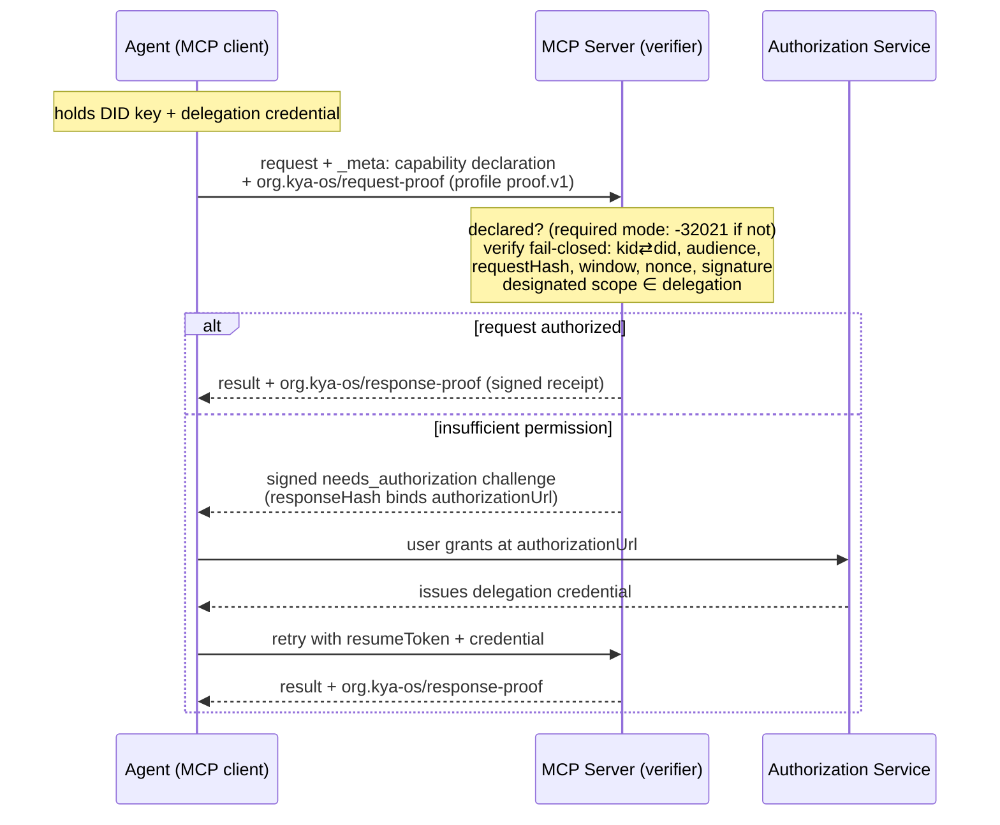

<!-- SPDX-License-Identifier: Apache-2.0 -->

# Decentralized Authority

**An MCP extension for decentralized agent identity, delegated authority, and per-request proof-of-possession.**

| | |
|---|---|
| **Extension id** | `org.kya-os/decentralized-authority` |
| **Version** | 1.0.0-draft |
| **Status** | Draft, prepared for MCP Extensions Track review |
| **License** | Apache-2.0 (this document, per the SPDX grant above; the host repository is otherwise MIT) |
| **Governing specifications** | [KYA-OS Protocol Specification](https://github.com/decentralized-identity/kya-os-mcp/blob/main/SPEC.md) and [Entity Card profile](https://github.com/decentralized-identity/kya-os-mcp/blob/main/SPEC-ENTITY-CARD.md), developed by the KYA-OS project, donated to and maintained as work items of the DIF Trusted AI Agents Working Group (TAAWG) |
| **Reference implementations** | [`@kya-os/mcp`](https://www.npmjs.com/package/@kya-os/mcp) (TypeScript; 1.11.0 on npm, negotiation module on repository `main` pending the next release), [`kya-os-verify` 0.2.0, beta](https://pypi.org/project/kya-os-verify/) (Python, verify-side, cross-language parity) |

## Abstract

This extension lets an MCP server verify, on every request, which agent is calling, whether the authority it is exercising authorizes the request, and that the live caller currently controls the key bound to that identity.
Identity is a W3C DID, authority is a W3C Verifiable Credential delegation chain with per-hop attenuation, and possession is a self-contained per-request proof carried in `_meta`.
Everything verifies locally from signed artifacts: no round trip to a central authorization service is required, which is a property associated with the name.
The default DID methods are `did:key` (raw public keys) and `did:web` (TLS and DNS); no distributed ledger is required or referenced by this extension.
The extension adds no tools, no JSON-RPC methods, and no sessions; its wire surface is one capability entry, reverse-DNS `_meta` keys, the `KYA-OS-*` outbound HTTP headers for gateway propagation, and discovery documents.
It composes with, and never replaces, MCP's OAuth-based authorization: it does not read or write the `Authorization` header.

## Conformance Keywords

The key words "MUST", "MUST NOT", "REQUIRED", "SHALL", "SHALL NOT", "SHOULD", "SHOULD NOT", "RECOMMENDED", "NOT RECOMMENDED", "MAY", and "OPTIONAL" in this document are to be interpreted as described in BCP 14 [RFC2119] [RFC8174] when, and only when, they appear in all capitals.

## 1. Dependencies

This document is a thin MCP binding.
The identity model, delegation semantics, proof profile, verification algorithm, and their security analysis are defined normatively by the governing specifications listed above, referenced here by section.
Implementers need those two documents; this one defines only what is MCP-specific.

This document is the venue-shaped condensation of [SPEC-MCP-EXTENSION.md](../SPEC-MCP-EXTENSION.md), the full MCP binding maintained in the same repository.
Until an MCP extension repository adopts this binding, SPEC-MCP-EXTENSION.md is authoritative on any conflict between the two; after adoption, the adopted text governs.
Changes to either document are mirrored in the same change set.

## 2. What the Extension Adds

| Surface | Mechanism | Defined in |
|---|---|---|
| Capability declaration | `capabilities.extensions["org.kya-os/decentralized-authority"]` settings object | §3, §4 |
| Request proof | `_meta["org.kya-os/request-proof"]` per-request holder-of-key proof | Entity Card §8 |
| Response proof | `_meta["org.kya-os/response-proof"]` detached response proof, including signed consent challenges | KYA-OS Spec §7, §9 |
| Delegated authority | W3C VC delegation chains, referenced from proofs via `delegationRef` | KYA-OS Spec §6 |
| Gateway propagation | `KYA-OS-*` outbound HTTP headers; body-free routing | KYA-OS Spec §8 |
| Discovery | Entity Card and projections; `server/discover` | Entity Card §5-§6; §4, §9 |

The extension defines **no tools and no new JSON-RPC methods**.
Both proof keys are role-named; versions live inside the objects, never in keys (the request proof's format version rides its `prf` field). The response-proof object is shared with the KYA-OS 1.x profile, distinguished by its own fields (KYA-OS Spec §7.5-§7.6); prior keys stay read-accepted for one major version.
The KYA-OS session machinery and `_kyaos_handshake` tool (KYA-OS Spec §5, §14), the legacy session-bound proof (Entity Card §15.5, Appendix D.4), and the legacy top-level `proof` result member are outside this extension.

The full request cycle, including the consent step-up that issues a delegation credential:



## 3. Settings Object

The settings object is declared under the extension id in the `extensions` capability map.
Its schema is published at [`schemas/mcp-extension-settings.json`](https://github.com/decentralized-identity/kya-os-mcp/blob/main/schemas/mcp-extension-settings.json) (JSON Schema 2020-12).
All members are OPTIONAL; an empty object means "supported, default configuration".

| Member | Type | Default | Meaning |
|---|---|---|---|
| `version` | string (semver) | `"1.0.0"` | The extension-document version implemented. The default tracks the published document version this draft becomes. |
| `proofProfiles` | string[] | `["org.kya-os/proof.v1"]` | Proof profiles minted (client) or verified (server). |
| `didMethods` | string[] | `["did:key", "did:web"]` | DID methods used (client) or resolved (server). |
| `required` | boolean | `false` | Server-side only: reject requests from clients that do not declare this extension (§5). Ignored on client declarations. |

A peer receiving a declaration MUST ignore unknown members.
A peer that receives a settings object it cannot parse — a declaration that is present but malformed, as distinct from one that is absent — MUST NOT treat it as a valid declaration, and MUST NOT guess at intent.
Because the declaration is an untrusted, intermediary-mutable, proof-excluded `_meta` member, its handling is mode-dependent: in optional mode a malformed declaration degrades to non-declaration exactly like an absent one (core MCP behavior), so a corrupting intermediary cannot turn an otherwise-valid request into a rejection when a mere strip would let it through; in required mode, where a non-declaring request is rejected regardless, the server MUST reject it with `-32602` (Invalid params) carrying `reason: "malformed_declaration"`, distinguishing a garbled declaration from a genuinely absent one (`-32021`, §5).
A declaration that is well-formed but omits members, or carries only unknown members, takes effect with each member at its default per the rule above.

## 4. Capability Declaration and Selection

The stateless MCP core (`2026-07-28`) has no handshake round trip, so this extension negotiates no session-wide agreement.
Instead the server *advertises* what it supports, the client *selects* from that set and *declares* its selection on each request, and the server *enforces* its own configured minimum on each request.
The selection is a hint; the enforcement is the security boundary.

A client declares the extension inside `_meta["io.modelcontextprotocol/clientCapabilities"]` on each request; the per-request proof object of Entity Card §8.2 rides beside it under `_meta["org.kya-os/request-proof"]`:

```json
{
  "io.modelcontextprotocol/clientCapabilities": {
    "extensions": {
      "org.kya-os/decentralized-authority": {
        "proofProfiles": ["org.kya-os/proof.v1"],
        "didMethods": ["did:key", "did:web"]
      }
    }
  }
}
```

A server advertises the extension in the `capabilities.extensions` member of its `server/discover` result (§9), listing the `proofProfiles` and `didMethods` it accepts.
A client MAY pre-flight `server/discover` and choose a profile and DID method from the intersection of its own and the server's advertised sets; a client that declares a profile the server does not advertise MUST expect a proof-profile error rather than silent acceptance.
For peers on the `2025-11-25` protocol, the same settings object travels in the initialize-era `capabilities.extensions` field, as an additive member that revision's schema does not define.
When both carriage forms are present, the per-request declaration takes precedence only for identifying the client's active configuration; it never lowers the profiles or DID methods the server requires.

A server MUST NOT weaken its verification requirements on the basis of a client's declaration.
The declared `proofProfiles` and `didMethods` may only select among methods the server already accepts; they can never move the server below its configured floor.
Because the load-bearing artifact is the signed proof and not the declaration, a declaration that names a weaker profile than the proof actually carries cannot make a server accept a proof it would otherwise reject: either the proof verifies under a profile the server accepts, or it fails closed.
This closes the protocol-downgrade path that an unqualified precedence rule would leave open.

A declaring client asserts that it can mint proofs under at least one listed profile and understands this extension's error surface.
A declaring server asserts that it verifies the listed profiles per the fail-closed algorithm of Entity Card §11.

## 5. Required Mode and Graceful Degradation

When `required` is absent or `false`, a request from a non-declaring client MUST be processed as core MCP: no proof is demanded and no extension error is emitted.

When `required` is `true`, a request whose client capabilities do not declare this extension MUST be rejected with the core MCP error `-32021` (`MissingRequiredClientCapabilityError`), carrying both the core schema's `requiredCapabilities` member and this extension's reason code:

```json
{
  "code": -32021,
  "message": "Missing required client capability: org.kya-os/decentralized-authority",
  "data": {
    "requiredCapabilities": { "extensions": { "org.kya-os/decentralized-authority": {} } },
    "reason": "extension_not_declared",
    "extension": "org.kya-os/decentralized-authority"
  }
}
```

Clients dispatch on `error.data.reason` (§6); where an SDK's typed error reconstruction surfaces only `requiredCapabilities`, membership of this extension's id in `requiredCapabilities.extensions` is the fallback discriminant.
Required mode MUST NOT gate `server/discover`: the pre-flight discovery of §4 and §9 has to remain reachable by non-declaring clients, or a client could never learn the requirement it fails.
Implementations SHOULD extend the same exemption to liveness pings from earlier protocol revisions.

`_meta` is intermediary-mutable and excluded from proof coverage by design (§7), so a stripped declaration is handled exactly as an absent one: rejection in required mode, core behavior in optional mode, never accepted as authenticated (a present-but-malformed declaration is handled per §3, mode-dependently).
The load-bearing artifacts are always the signed proof and credentials, never the declaration.

## 6. Errors

This extension allocates **no numeric JSON-RPC codes**.
Implementations MUST NOT emit codes from the MCP-reserved `-32020` to `-32099` range for this extension's errors, other than core `-32021` exactly as specified in §5.
The failure taxonomy rides `error.data`:

```json
{ "code": -31000, "message": "KYA-OS proof required",
  "data": { "reason": "proof_missing", "profile": "org.kya-os/proof.v1" } }
```

Numeric codes for these errors are allocated outside the JSON-RPC reserved range (`-32768` to `-32000`), per the core allocation policy; the legacy `-32000` to `-32019` sub-range is not used.

`error.data.reason` carries a snake_case code from the governing specifications verbatim (Entity Card Appendix D; KYA-OS Spec Appendix A).
Client behavior MUST be keyed by `error.data.reason`; clients MUST NOT vary behavior on the implementation-defined numeric code.
This document defines two reason codes of its own: `extension_not_declared` (inside a `-32021` error) and `malformed_declaration` (inside a `-32602` error, §3).

## 7. Per-Request Proof

The request proof is `org.kya-os/proof.v1`, defined in Entity Card §8 and verified in the exact fail-closed order of Entity Card §11.2.
The MCP-specific bindings are:

1. The proof object rides `_meta["org.kya-os/request-proof"]` inside the request's `params` - the role-named carrier of the `org.kya-os/proof.v1` profile (Entity Card §8.1; the legacy key and `prf` value `org.kya-os/proof@1` are accepted for one major version).
2. Its `requestHash` covers `{ method, params }` with `params._meta` removed (Entity Card §8.3).
   An intermediary can therefore add or rewrite `_meta` members, such as the required `io.modelcontextprotocol/*` keys, without invalidating the proof, and any mutation of covered request material invalidates the proof by construction.
   Because `_meta` is both intermediary-mutable and outside proof coverage, its contents are untrusted: a verifier derives no security decision from any `_meta` member except by verifying the signed proof that member carries.
3. The proof is in-band JSON-RPC and verifies identically over stdio and Streamable HTTP; an OPTIONAL RFC 9421 sibling signature (Entity Card §8.5) serves HTTP-edge intermediaries, and the profile's relationship to DPoP is specified in Entity Card §8.8 (the two compose).

Response-side proofs (KYA-OS Spec §7) cover the response body only.
Result members outside the body, including the `2026-07-28` `resultType` member, are outside `responseHash` coverage.

## 8. Delegated Authority and Consent

Declaring the extension conveys no authority.
Authority is conveyed only by a verifiable delegation chain (KYA-OS Spec §6, including the VC 2.0 + ZCAP-LD profile of §6.10), referenced from proofs via `delegationRef`, with per-hop attenuation, the designation invariant, and revocation via W3C Status Lists.
This is a capability system in the lineage of ZCAP-LD, UCAN, and SPKI/SDSI (References, Informative).
Status lists SHOULD be published per issuing authority — each delegation's status served from the issuer's own domain — rather than through a single centralized registry, preserving the no-central-authority property the extension is named for.

A call lacking sufficient permission returns the signed `needs_authorization` challenge of KYA-OS Spec §9, carried as the body of a `resultType: "complete"` result.
The challenge's `responseHash` binds its content, including `authorizationUrl`; a client MUST verify the challenge proof before directing a user to that URL, and applies the RFC 9207 issuer validation required by KYA-OS Spec §9.4 on the authorization callback.
When a server calls downstream services under a delegation, outbound propagation uses the `KYA-OS-*` header registry and the body-free routing of KYA-OS Spec §8; advisory headers are never authorization inputs there.

## 9. Discovery

Discovery is the Entity Card layer: the DID-anchored `card.json` (Entity Card §5) and its projections onto MCP `server.json` / `catalog.json` `_meta["org.kya-os/card"]`, A2A, and NANDA (Entity Card §6, with mandatory SSRF-hardened fetching per Entity Card §6.6), plus the CIMD on-ramp (Entity Card §7).
The `server/discover` advertisement (§4) is the in-protocol surface: a client can learn whether a server speaks, and requires, this extension before the first tool call.
This binding defines no well-known endpoint; server metadata at well-known paths is deferred to the MCP Server Card work.

## 10. Security Considerations

The threat models of KYA-OS Spec §11 and Entity Card §12 apply in full.
Extension-specific notes:

1. **Declaration stripping** degrades to §5's fail-closed handling; the declaration is never a trusted input.
2. **`_meta` coexistence**: verifiers read only KYA-OS keys and never hash, trust, or reject on foreign `_meta` keys (KYA-OS Spec §7.6); handlers SHOULD NOT derive authorization decisions from unsigned `_meta` content.
3. **Token non-interference**: this extension never reads or writes the `Authorization` header; OAuth remains the token layer and the core token-passthrough prohibition is untouched.
4. **Replay scope**: proof construction is stateless, verification is not; a verifier without a nonce seam fails closed (`nonce_seam_missing`, per Entity Card §11.2), and multi-replica deployments use an atomic, shared or replica-sticky nonce store (Entity Card §12.2) when duplicate execution of a byte-identical request within the 60-second window is unacceptable, the same bound DPoP carries via server-side `jti` tracking.
   Because every proof carries a freshness window of at most 60 seconds, observed nonces need be retained only for that window plus the verifier's maximum tolerated clock skew: a proof replayed after the window fails the freshness check independently of the nonce store, so nonce retention is bounded by the proof window, not by the delegation lifetime.
5. **Cost profile**: warm-path verification is local CPU; cold paths fetch DID documents and status lists through SafeFetch, with revocation staleness bounded by status-cache TTL (short TTLs recommended for high-privilege scopes, KYA-OS Spec §6.5.2).

## 11. Privacy Considerations

A stable DID plus per-request signed proofs makes an agent's activity linkable and non-repudiable, which is the goal in audit deployments and a cost elsewhere.
Implementations SHOULD support pairwise per-audience DIDs, and this extension does not require a globally stable DID for conformance.
Delegate keys SHOULD be one-off and short-lived (KYA-OS Spec §6.9): a fresh key per delegation bounds both replay and key-compromise exposure and reinforces the pairwise-DID unlinkability above.
Where an operator must be able to revoke every delegation a principal holds in a single action — offboarding a departing employee, for instance — it MAY instead bind that principal's delegations to one revocable key and revoke that key, accepting the reduced unlinkability a shared key implies.
Delegation credentials disclose delegating principals to chain verifiers; issuers SHOULD use opaque organization-resolvable subject identifiers, and cards are claim-minimal by design, carrying no principal PII (Entity Card §4.2, §13).
Verifiers SHOULD fetch whole status lists (herd privacy), and deployments should define proof-retention windows (KYA-OS Spec §12.4).

## 12. Backward Compatibility

The extension is strictly additive.
A peer that ignores it gets core MCP behavior end to end; a stripped discovery projection degrades to a fetch of the canonical card, never a failure (Entity Card §6).
The KYA-OS 1.x session profile and the prior response-proof keys (`org.kya-os/proof`, bare `proof`) remain governed by the KYA-OS Specification (§5, §7.6) outside this extension.

## References

**Normative**: KYA-OS Protocol Specification v1.0.0; KYA-OS Entity Card profile v1.1; `schemas/mcp-extension-settings.json`; MCP specification revision `2026-07-28`; SEP-2133; BCP 14.
**Informative**: RFC 9449 (DPoP); RFC 9207; RFC 9421; W3C DID Core, VC Data Model 2.0, Bitstring Status List; MCP `ext-auth` extensions; related capability systems — W3C ZCAP-LD, UCAN, and SPKI/SDSI (RFC 2693).
